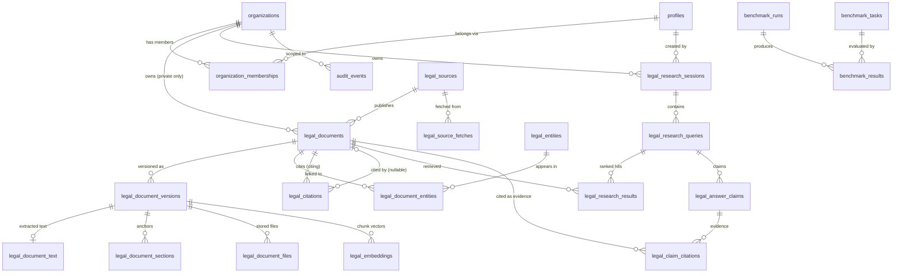

# LawME — POC Entity-Relationship Diagram

## Reading the diagram
- **Tenancy boundary:** `legal_documents.organization_id` is nullable —
  NULL rows are the shared global corpus; the research chain
  (sessions→queries→results→claims→citations) is always
  organization-owned. `audit_events`, `benchmark_*`, `legal_sources`,
  `legal_entities`, `legal_source_fetches` are global infrastructure.
- **Version-centric content:** text, sections (anchors), files and
  embeddings attach to a *version*, never directly to the document —
  re-extraction produces version 2 alongside version 1.
- **Citations are the graph's layer 2** (LEGAL_KNOWLEDGE_GRAPH_ARCHITECTURE.md):
  `legal_citations` may point to an ingested document (resolved) or carry
  only a normalized case number / statute ref (unresolved — resolvable
  later without schema change).
- **Claims → citations** is the drafting/answer provenance chain: every
  answer claim has zero-or-more evidence rows; a claim with zero evidence
  can only carry the labels `unresolved`/`unknown` (application-enforced,
  benchmark-tested).
