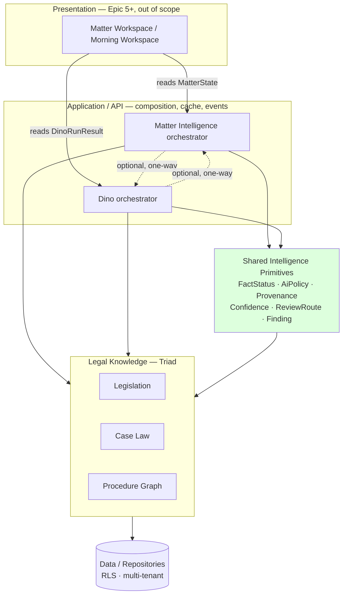

# Matter Intelligence — Dependency Model (Epic 4 Architecture Review)

Status: review artifact. No code changes. Defines the *permanent* dependency
direction the codebase should hold to after Epic 4 commits.

## Current state (verified by import audit)

- `src/modules/matter/**` imports **only** `legal-knowledge/procedure/*` and
  `legal-knowledge/triad/coverage`. It does **not** import `dino/**`.
- `src/modules/dino/**` does **not** import `matter/**`.
- Both Matter and Dino are independent clients of `legal-knowledge`.

There is **no Matter↔Dino cycle today**. This is the correct shape and must be
preserved. The risk is not a current cycle; it is *drift* — future code wiring
Dino to call Matter engines (or vice versa) directly, and the two duplicated
primitives (facts, AI policy) silently diverging.

## Layered model (target)

```
        ┌─────────────────────────────────────────────┐
        │  Presentation (Epic 5+, NOT in scope)         │
        │  Matter Workspace · Morning Workspace · /dev  │
        └───────────────┬───────────────────────────────┘
                        │ reads MatterState / DinoRunResult (never engines directly)
        ┌───────────────┴───────────────┐
        │        Application / API        │   composition, caching, events
        └───┬───────────────────────┬─────┘
            │                       │
   ┌────────┴────────┐     ┌────────┴─────────┐
   │ Matter          │     │ Dino             │   ← two DOMAIN ORCHESTRATORS,
   │ Intelligence    │     │ Orchestrator     │     peers, never call each other
   │ (assessMatter)  │     │ (runDinoPipeline)│
   └───┬─────────┬───┘     └───┬──────────┬───┘
       │         │             │          │
       │         └──────┬──────┘          │
       │        ┌───────┴────────┐        │
       │        │ Shared          │        │   ← proposed: intelligence primitives
       │        │ Intelligence    │        │     (FactStatus, AiPolicy, Provenance,
       │        │ Primitives      │        │      Confidence, ReviewRoute, Finding)
       │        └───────┬────────┘        │
       │                │                 │
   ┌───┴────────────────┴─────────────────┴───┐
   │        Legal Knowledge (Triad)            │   ← single source of legal truth
   │  Legislation · Case Law · Procedure Graph │
   └───────────────────┬───────────────────────┘
                        │
             ┌──────────┴──────────┐
             │  Data / Repositories │   ← Supabase, RLS, multi-tenant
             └──────────────────────┘
```

## Mermaid



The two dotted Matter↔Dino edges are **optional, one-directional, and mediated
by the Application layer** — never a mutual import. See rule below.

## The ten ownership questions

1. **Does Dino orchestrate Matter Intelligence?** No. They are peer domain
   orchestrators. Dino answers "what is the law / what does this question
   require"; Matter answers "what is the state of this file and what next".
   An application-level flow may run Matter first (to assemble state) and pass a
   *bounded context package* into Dino, or run Dino and fold its result into a
   Matter finding — but neither module imports the other.
2. **Does Matter Intelligence call Dino stages?** No. Matter must never reach
   into Dino's 26 stages. If Matter needs a legal answer it consumes the Triad
   coverage model (as it does now) or, later, a *Dino result object* handed to
   it by the application layer — not Dino internals.
3. **Are both clients of shared engines?** Yes — this is the target. Today they
   share `legal-knowledge` only. They should additionally share a small set of
   **intelligence primitives** (facts/epistemic status, AI policy, provenance,
   confidence, review route, finding/severity). See ADR-0002.
4. **Which layer owns facts?** The **matter record** (data layer) is the source
   of truth for facts and their epistemic status. Both Dino's context assembler
   and Matter's `Matter.facts` are *projections* of that record and must use one
   shared `FactStatus` primitive. Today they use two divergent enums — the
   central defect this review flags (see the review + source-of-truth matrix).
5. **Which layer owns legal analysis?** Legal Knowledge (Triad) owns the law;
   Dino owns the *analytical pipeline* over it (issues, retrieval, coverage,
   drafting, QA). Matter consumes coverage but must not re-derive legal
   conclusions.
6. **Which layer owns recommendations?** Each domain owns its own recommended
   actions (Matter: procedural/operational next-actions; Dino: research/answer
   routing). They share the `RecommendedAction`/`Finding` *shape*, not a single
   list. The application layer may merge them for display.
7. **Which layer owns confidence?** The **shared primitive** owns the *shape*
   (`ConfidenceReport`, decomposed, never one unexplained number). Each engine
   owns its *values*. Matter currently under-models this (a bare number); it
   should adopt Dino's `ConfidenceReport` primitive.
8. **Which layer owns human-review routing?** The shared primitive owns the
   `ReviewRoute` shape (Dino already has the mature version). Every domain emits
   routes; the application layer unions them. Matter currently under-models this
   (a bare boolean).
9. **Which layer owns audit?** The data/application layer owns the audit event
   store (Dino already routes to `audit_events`). Engines *emit* auditable
   artifacts; they do not own persistence. Matter engines are pure functions and
   must stay that way.
10. **Which layer owns the final narrative?** A dedicated **Matter Narrative
    Engine** (proposed, deterministic templates first) owns the matter briefing;
    Dino owns its own answer narrative (controlled draft). Neither engine invents
    facts — both consume only verified structured assessments.

## The one hard rule

> Matter and Dino may be **composed** by the layer above them, but they must
> never **import** each other. Any cross-domain data flows as a typed,
> minimized package through the application layer. Shared *concepts* live in the
> shared primitives module, not in one domain reaching into the other.

This keeps the graph acyclic and lets Client / Document / Office / Team / Finance
intelligence be added later as further peer domains, all standing on the same
primitives and the same Legal Knowledge base.
