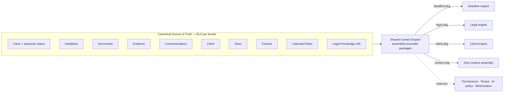

# Shared Context Engine (Epic 4 Architecture Review — design only)

Designs the future engine that assembles the bounded context each intelligence
domain needs from the shared substrate: Matter, Client, Calendar, Tasks,
Documents, Evidence, Communications, Team, Finance, Legal Knowledge, and Dino.

## The problem it solves — and the anti-pattern to avoid

Dino **already** has a context assembler (`assembleMatterContext` →
`MatterContextPackage`, stage 3 of 26). Matter Intelligence has its own `Matter`
object. These are **two representations of the same underlying reality** (a
matter's facts, deadlines, parties, restrictions), with divergent shapes and —
critically — divergent epistemic-status enums (`ContextItemStatus` vs
`FactStatus`). Left alone, every new domain (Client, Document, Office) will grow
a *third*, *fourth*, *fifth* representation of "the matter's context".

The anti-pattern to avoid is equally dangerous: a **single giant context object**
passed everywhere. That maximizes coupling, over-shares private data with engines
that do not need it, and makes privacy/tenant boundaries impossible to reason
about.

## Recommendation: one canonical store, many bounded context packages

- **One canonical, RLS-scoped source of truth** per entity (facts, deadlines,
  documents, …) in the data layer — see the Source-of-Truth Matrix.
- **Bounded context packages** assembled *per consuming engine*, containing only
  the fields that engine needs. The Deadline engine gets deadlines + asOf; the
  Client engine gets client dims; the Legal engine gets topic + refIds + confirmed
  facts. No engine receives the whole graph.
- **One shared epistemic-status + provenance primitive** so a "fact" means the
  same thing to Dino, Matter, and every future domain. This is the single most
  important unification and the reason the two current enums must be reconciled
  before more consumers appear.

## Context graph (conceptual)

## Responsibilities to define

- **Context graph** — entities and their relationships (above). One node per
  entity, one owner each.
- **Source of truth** — deferred to the Source-of-Truth Matrix; the SCE reads it,
  never overwrites it.
- **Context assembly** — per-engine assembler functions returning typed, minimal
  packages. Composition, not a god object.
- **Context minimization** — each package includes only fields the engine
  declares it needs; the assembler enforces this (a Deadline package cannot carry
  privileged client narrative).
- **Permissions & tenant boundaries** — every assembly is RLS-scoped; a package
  can never span tenants; assembly runs under the caller's tenant context.
- **AI-policy boundaries** — when the client's AI policy is
  `restricted_no_private_context` or `prohibited`, the assembler strips or refuses
  private context accordingly, uniformly for every consumer. This is where the
  policy is *enforced*, not just read.
- **Freshness** — each package carries the `computedAt`/`inputsHash` of its
  sources so downstream results inherit honest staleness.
- **Event propagation** — the SCE is the natural place to translate domain events
  into the `event → dirty engines` invalidations (Execution Model).
- **Privacy & audit** — assembly is logged as metadata only (which fields, which
  tenant, which engine) — never the private values (Observability).

## Migration path (no code now)

1. **Reconcile primitives first** (facts/epistemic status, AI policy,
   confidentiality, provenance) into the shared module. This is the prerequisite;
   without it the SCE just formalizes the divergence.
2. Introduce per-engine context-package types (thin, derived from `Matter`).
3. Have Dino's stage-3 assembler and Matter both build from the canonical store
   via the SCE, returning their bounded packages — deleting the duplicate fact
   representation.
4. Add new domains (Client, Document, Office) as further package types, never as
   new full-context objects.

## Bottom line

The Shared Context Engine is a **future** component. Epic 4 does not build it. But
Epic 4 is exactly the moment to stop the divergence: reconcile the fact and
policy primitives now, before Dino's `ContextItem` and Matter's `MatterFact`
become two frozen, incompatible truths that every later domain copies.
