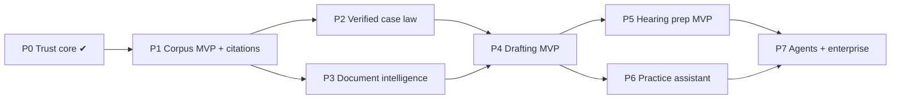
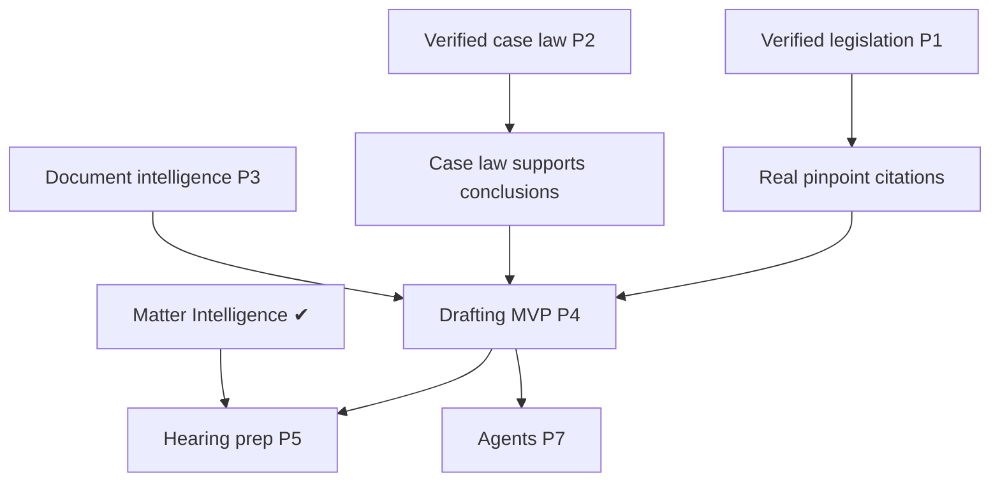

# Dino — Implementation Roadmap

**Companion to** [`DINO_MASTER_SPECIFICATION.md`](./DINO_MASTER_SPECIFICATION.md) (see [Volume 22](./DINO_MASTER_SPECIFICATION.md#volume-22--product-roadmap)) and [`DINO_V1_EXECUTIVE_SPEC.md`](./DINO_V1_EXECUTIVE_SPEC.md). This is the sequenced implementation index. It maps phases → slices → acceptance, and names the **recommended next slice**. Specification only — nothing here is built, committed, or pushed.

## How to read this

- **Workstreams:** A Product experience · B Verified corpus · C Reasoning · D Documents · E Drafting · F Hearing · G Practice assistant · H Agents · I Enterprise · J Evaluation & safety.
- **Every slice** obeys the [Volume 24](./DINO_MASTER_SPECIFICATION.md#volume-24--implementation-governance) slice contract: user-visible value · domain authority · source requirements · authorization boundary · safety boundary · evaluation plan · tests · migration impact · provider impact · rollback · stop gate.
- **Rule:** after this master spec, every slice must add something a lawyer can *see or use*, unless it closes a genuine security or data-quality blocker. **Corpus (B) is the pacing workstream.**

## Status of foundations (P0 — shipped)

| Capability | Module | State |
|---|---|---|
| Matter Bootstrap | matter/bootstrap | shipped |
| Matter Workspace | matter/workspace | shipped |
| Matter Intelligence | matter/intelligence | shipped |
| Conversation Engine | dino/conversation | shipped |
| Legal Research Orchestrator | legal-research | shipped |
| Dino Experience | dino/experience | shipped |
| Legal Reasoning Engine | legal-reasoning | shipped |
| Reasoned Dino Integration | dino/reasoned | shipped |

The trust core is complete and green (all suites + `capability1:freeze-check`). What remains for V1 is **reach and polish**, gated by corpus.

---

## Phase plan

### P1 — Corpus MVP + citation polish (workstreams B, A, J) — *V1 launch-critical*

**User-visible outcome:** answers cite real, verified statutes/regulations with true pinpoints and copy/export-ready form.

| Slice | Value | Acceptance | Legal-data req. |
|---|---|---|---|
| P1-S1 | Verified legislation ingestion (covered doctrines) with permalink + amendment history + pinpoints | Covered statutes verified per [DR-3](./DINO_MASTER_SPECIFICATION.md#required-decision-records); coverage map published | Official legislation source, licensed/open |
| P1-S2 | Citation rendering polish (source cards, labels, copy, Word export) | Copy/export matches the Israeli-practice standard ([Vol 5](./DINO_MASTER_SPECIFICATION.md#volume-5--verified-source-and-citation-standard)); no whole-doc-as-pinpoint | metadata only |
| P1-S3 | Coverage map + honest-coverage surfacing | Uncovered doctrines listed; coverage never "complete" | coverage config |
| P1-S4 | Eval: verified-citation-accuracy benchmark + gate | 100% on benchmark; release gate wired | gold set |

**Must not build yet:** case-law-as-support (P2), drafting, agents.

### P2 — Verified case law (B, C, J)

**Outcome:** case law can *support* (not merely discover) a conclusion for defined doctrines.

| Slice | Value | Acceptance |
|---|---|---|
| P2-S1 | Case-law verification + treatment pipeline | ≥1 doctrine answerable with verified binding authority; overruled never supports |
| P2-S2 | Authority-hierarchy + currency in reasoning uses verified case law | conflicting-authority path validated ([DR-8](./DINO_MASTER_SPECIFICATION.md#required-decision-records)) |
| P2-S3 | Eval: contrary-authority recall + currency gate | recall + currency thresholds met |

**Must not build yet:** court-facing drafting bar ([DR-10](./DINO_MASTER_SPECIFICATION.md#required-decision-records)) beyond memo.

### P3 — Document intelligence (D, A)

**Outcome:** upload a document → grounded extraction, obligations, contradictions, missing clauses, deadlines, with page/paragraph pinpoints linked to matter facts.

| Slice | Value | Acceptance |
|---|---|---|
| P3-S1 | Extraction + pinpointed quoting (PDF/DOCX) | every quote has a pinpoint + version |
| P3-S2 | Obligation/contradiction/missing-clause analysis | flagged with grounding; OCR-confidence surfaced |
| P3-S3 | Link document claims to matter facts / evidence map | claims map to MI facts |

### P4 — Drafting MVP (E, C, J)

**Outcome:** turn an answer into a reviewable memo/letter with grounded citations and unsupported-text detection.

| Slice | Value | Acceptance |
|---|---|---|
| P4-S1 | Opinion → outline → source map → memo draft | every legal proposition grounded or flagged unsupported |
| P4-S2 | Word export + redline + version history | export matches citation standard; approval gate before send/file ([DR-11](./DINO_MASTER_SPECIFICATION.md#required-decision-records)) |
| P4-S3 | Court-facing bar enforcement | unsupported propositions block court-facing export ([DR-10](./DINO_MASTER_SPECIFICATION.md#required-decision-records)) |

### P5 — Hearing prep MVP (F, C)

**Outcome:** issue list, chronology, disputed facts, evidence gaps and a verified authorities bundle for a matter.

| Slice | Value | Acceptance |
|---|---|---|
| P5-S1 | Issue list + chronology + disputed-facts from MI | reflects MI; no fabricated facts |
| P5-S2 | Authorities bundle (verified only for reliance) | discovery-only items labeled leads |

### P6 — Practice assistant (G, A)

**Outcome:** deadlines/tasks/workload surfaced; side-effecting actions only after approval.

| Slice | Value | Acceptance |
|---|---|---|
| P6-S1 | Read/summarize calendar, deadlines, tasks | isolation honored; read-only |
| P6-S2 | Recommend + execute-after-approval actions | explicit approval per [DR-11](./DINO_MASTER_SPECIFICATION.md#required-decision-records) |

### P7 — Agents + enterprise (H, I, J)

**Outcome:** delegated, audited multi-step work; enterprise controls (residency, retention, admin).

| Slice | Value | Acceptance |
|---|---|---|
| P7-S1 | Orchestrator + first read-only agents (Research, Citation-Verification) | bounded, audited, no overlapping authority ([Vol 15](./DINO_MASTER_SPECIFICATION.md#volume-15--agent-architecture)) |
| P7-S2 | Approval-gated action agents | every side-effect approved + audited |
| P7-S3 | Enterprise controls | provider policy/residency enforced ([DR-13](./DINO_MASTER_SPECIFICATION.md#required-decision-records)) |

---

## Dependency map (critical path)

The corpus workstream (B) is the longest pole: P1-S1 (verified legislation) and P2-S1 (verified case law) gate the launch claim and every downstream work-product phase.

---

## Recommended next implementation slice

**P1-S1 — Verified legislation ingestion for the V1 covered doctrines**, paired immediately with **P1-S4** (verified-citation-accuracy benchmark + release gate).

**Why:** the trust core is done; the one thing standing between Dino and a defensible "grounded research" claim is verified legislation with real pinpoints. It is the highest-leverage, most lawyer-visible next step, it directly closes launch blocker LB-3, and it does not depend on any not-yet-built engine. It also establishes the ingestion + verification discipline the entire corpus roadmap reuses.

**Preconditions/founder decisions needed first:** ratify the V1 covered-doctrine list ([Open Question 1](./DINO_MASTER_SPECIFICATION.md#open-questions)) and confirm the legislation source + license ([Vol 21](./DINO_MASTER_SPECIFICATION.md#volume-21--legal-knowledge-acquisition-roadmap)). No unlicensed scraping ([R-21.1](./DINO_MASTER_SPECIFICATION.md#volume-21--legal-knowledge-acquisition-roadmap)).

**Stop gate:** build → validate (verification bar + benchmark) → deliver → STOP; no production, no push, founder review.

---

*Specification only. No implementation, code, SQL, migration, provider or source connection was created or changed; nothing was committed or pushed; Production was untouched.*
