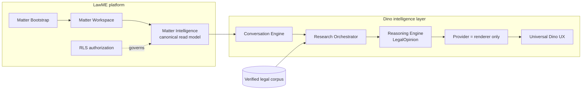
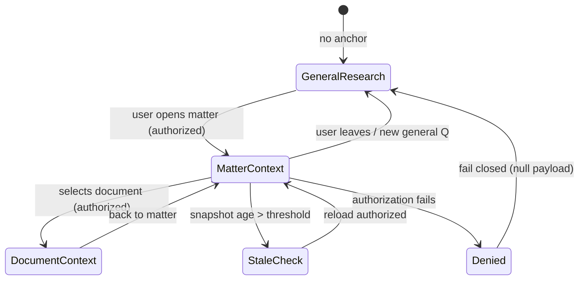
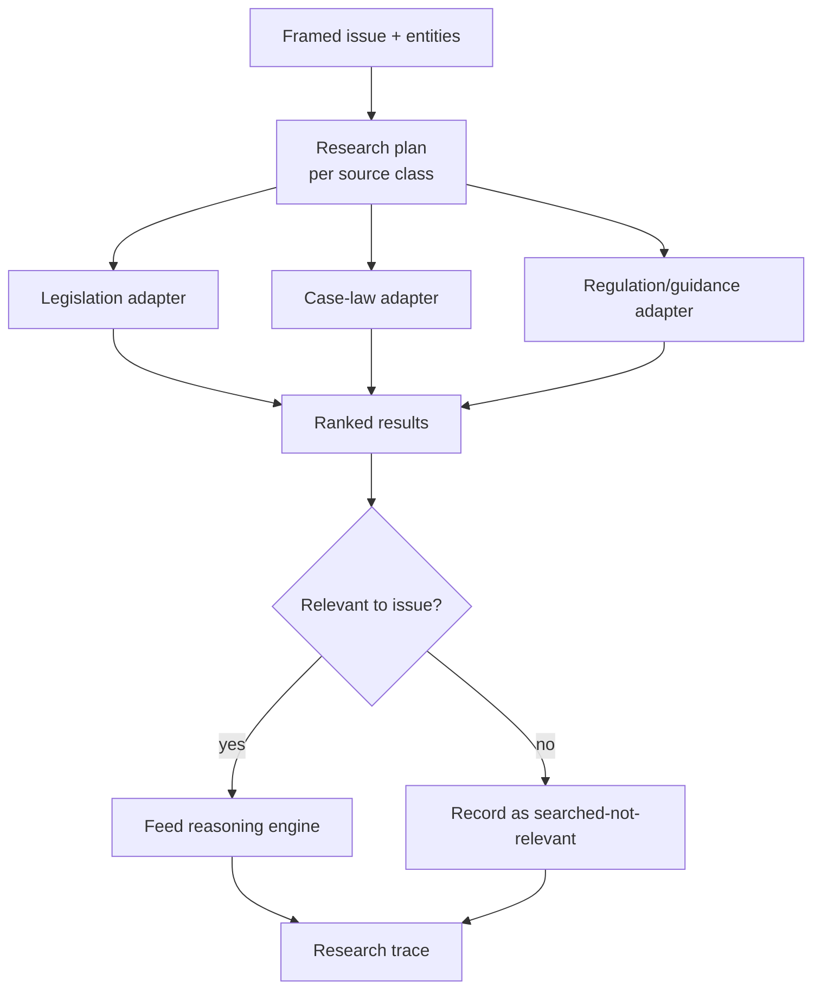
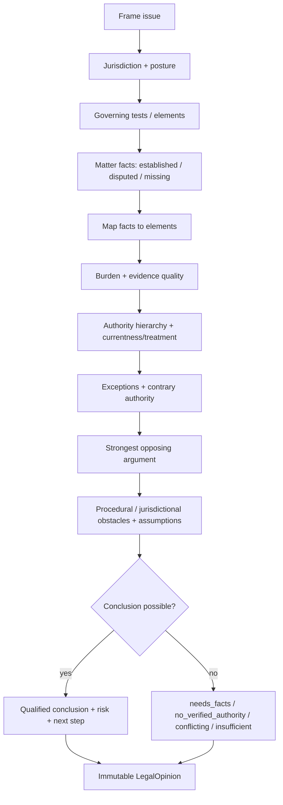
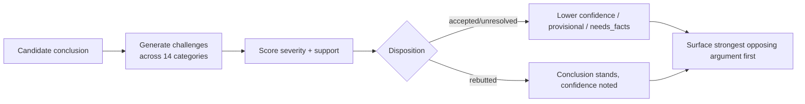
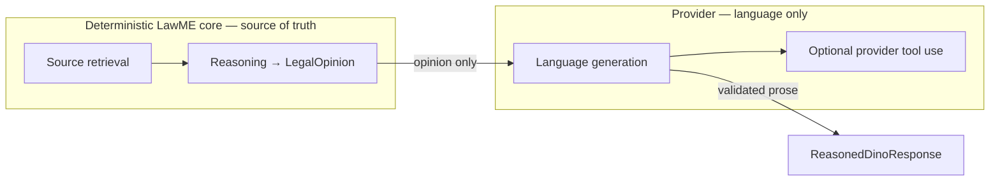
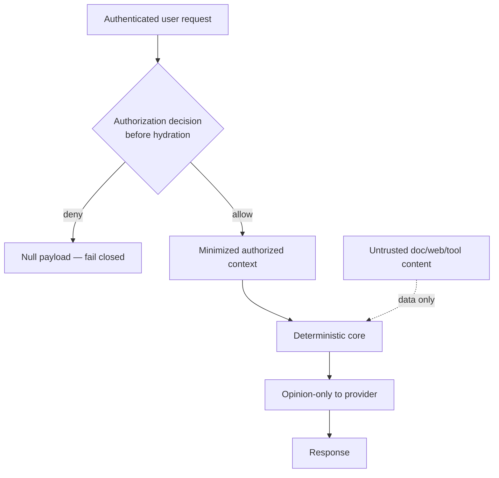

# Dino — Master Specification

**Product, Legal-AI, Research, Reasoning, UX, Security and Delivery Blueprint**

| | |
|---|---|
| **Document status** | Canonical master specification — DRAFT for founder review |
| **Owner** | Founder (Tal Zatelman) |
| **Scope** | Dino as the universal legal operating system inside LawME |
| **Horizon** | 5 years |
| **Implementation status of this document** | Specification only. No code, SQL, migration, provider, or source connection was created or changed. |
| **Supersedes** | Ad-hoc slice docs (`SLICE_2_0_0` … `SLICE_4_1_0`) as the *authority of record* for Dino direction. Those remain valid as implementation history. |
| **Foundations already shipped** | Matter Bootstrap · Matter Workspace · Matter Intelligence · Dino Conversation Engine · Legal Research Orchestrator · Dino Experience · Legal Reasoning Engine · Reasoned Dino Integration |

> **Reading guide.** This document is long but navigable. Start with the [Executive Summary](#executive-summary) and [Volume 23 — V1 Definition](#volume-23--v1-definition) for the shippable picture. Read [Volume 6](#volume-6--legal-reasoning-framework), [Volume 5](#volume-5--verified-source-and-citation-standard) and the [Decision Records](#required-decision-records) for the non-negotiable core. Engineering governance lives in [Volume 24](#volume-24--implementation-governance). Requirements are numbered `R-<vol>.<n>` and are the testable units.

---

## Table of contents

- [Executive summary](#executive-summary)
- [Founder vision — frozen](#founder-vision--frozen)
- [Volume 1 — Executive product definition](#volume-1--executive-product-definition)
- [Volume 2 — Universal context model](#volume-2--universal-context-model)
- [Volume 3 — Capability map](#volume-3--capability-map)
- [Volume 4 — Legal research system](#volume-4--legal-research-system)
- [Volume 5 — Verified source and citation standard](#volume-5--verified-source-and-citation-standard)
- [Volume 6 — Legal reasoning framework](#volume-6--legal-reasoning-framework)
- [Volume 7 — Adversarial and self-challenge standard](#volume-7--adversarial-and-self-challenge-standard)
- [Volume 8 — Answer experience](#volume-8--answer-experience)
- [Volume 9 — Universal Dino UX](#volume-9--universal-dino-ux)
- [Volume 10 — Conversation system](#volume-10--conversation-system)
- [Volume 11 — Document intelligence](#volume-11--document-intelligence)
- [Volume 12 — Drafting system](#volume-12--drafting-system)
- [Volume 13 — Hearing and litigation intelligence](#volume-13--hearing-and-litigation-intelligence)
- [Volume 14 — Practice and office assistant](#volume-14--practice-and-office-assistant)
- [Volume 15 — Agent architecture](#volume-15--agent-architecture)
- [Volume 16 — Model and provider strategy](#volume-16--model-and-provider-strategy)
- [Volume 17 — Security, privacy and authorization](#volume-17--security-privacy-and-authorization)
- [Volume 18 — Professional responsibility and safety](#volume-18--professional-responsibility-and-safety)
- [Volume 19 — Observability and audit](#volume-19--observability-and-audit)
- [Volume 20 — Quality and evaluation](#volume-20--quality-and-evaluation)
- [Volume 21 — Legal knowledge acquisition roadmap](#volume-21--legal-knowledge-acquisition-roadmap)
- [Volume 22 — Product roadmap](#volume-22--product-roadmap)
- [Volume 23 — V1 definition](#volume-23--v1-definition)
- [Volume 24 — Implementation governance](#volume-24--implementation-governance)
- [Required decision records](#required-decision-records)
- [Top product-audit findings — binding responses](#top-product-audit-findings--binding-responses)
- [Glossary](#glossary)
- [Open questions](#open-questions)

---

## Executive summary

Dino is the legal intelligence layer of LawME: a single, always-present professional assistant that behaves like a senior Israeli labor-law partner who has read the file, knows the law, checks the sources, challenges their own conclusion, names what is missing, explains the risk, and never bluffs. It is not a chatbot bolted onto a case-management tool; it is the reasoning surface through which lawyers work the matter.

The architecture that makes this trustworthy is already proven in the shipped foundations and is frozen as doctrine here: **LawME owns the legal truth deterministically, and the language model only phrases it.** Research retrieval, fact classification, element analysis, adversarial self-challenge, authority hierarchy, the conclusion, the confidence and the coverage are all computed by deterministic LawME engines producing an immutable `LegalOpinion`. The provider receives only that opinion and converts it to Hebrew. Provider output is validated: any attempt to change the conclusion direction or confidence level, or to introduce a citation it was not given, is rejected and the structured opinion is rendered instead. This is the single most important product decision in the company and everything below serves it.

The honest constraint today is corpus breadth: only a few statutes carry a verified pinpoint/permalink and **all case law is currently discovery-only (unverified)**. Dino is deliberately honest about this — unverified authority may aid discovery but may never support a conclusion, confidence caps at low/moderate, and coverage is never reported as "complete". The single largest determinant of Dino's commercial value over the next two years is therefore not model quality but **verified legal-corpus acquisition** ([Volume 21](#volume-21--legal-knowledge-acquisition-roadmap)).

This specification defines Dino across 24 volumes, 15 binding decision records, and a five-year roadmap that prioritizes visible, lawyer-usable progress on top of that trustworthy core. [Volume 23](#volume-23--v1-definition) defines a V1 small enough to ship and strong enough to be trusted: general labor-law research plus matter-aware analysis, document upload, professional citations, the full research view, conversational refinement, export to work product, and an honest deterministic fallback — restricted to Israeli labor law, and explicitly **not** yet claiming production-grade case-law coverage.

---

## Founder vision — frozen

These statements are settled and constrain every volume. They are restated as testable doctrine.

- **F-1. Omnipresence.** Dino is available from every screen in LawME. The user never chooses a "mode".
- **F-2. Automatic context.** Dino understands current page, active matter, selected document, conversation history, user role and permissions, office context, jurisdiction, research scope and requested outcome — without being told.
- **F-3. Two operating contexts, one product.** (A) General legal research with no active matter. (B) Contextual legal assistance combining authorized matter/document/calendar/workflow/office context with verified research. Same engine, same guarantees.
- **F-4. Investigate by default.** For every substantive legal question Dino normally investigates applicable legislation, regulations, relevant case law, conflicting authority, currentness and treatment, exceptions, and procedural limitations.
- **F-5. Never fabricate authority.** Legal conclusions are based on verified sources. Unverified material may assist discovery but may not support a conclusion.
- **F-6. Always distinguish epistemic status.** Verified law · legal analysis · inference · assumption · disputed fact · allegation · missing fact · unresolved authority · uncertainty are visibly separated, never blended.
- **F-7. Senior-partner behavior.** Read the file, know the law, check the sources, challenge the conclusion, identify what is missing, explain risk, show the strongest opposing argument, recommend the next professional step, never bluff.
- **F-8. The model is not the source of truth.** The provider phrases a pre-computed opinion; it never decides the issue, the test, element satisfaction, authority, conclusion, risk, confidence, provisional-ness, or the opposing argument.

---

## Volume 1 — Executive product definition

### 1.1 What Dino is

Dino is the **legal intelligence layer across the entire LawME platform** — one universal assistant, present on every screen, that turns authorized matter context and verified legal sources into professional, grounded, inspectable legal work product. It spans a spectrum from a two-sentence answer to a full reasoned legal opinion to a drafted work product, always over the same deterministic reasoning core.

### 1.2 What Dino is not

- Not "merely chat", search, summarization, drafting or document review — those are *capabilities* of Dino, not its identity.
- Not a generic LLM wrapper. The model may not decide legal outcomes.
- Not a citation generator that emits plausible-looking references. Every cited authority is real, retrieved, and verification-labeled.
- Not a replacement for a lawyer's judgment or for human review of client- and court-facing work.
- Not a multi-mode tool the user must configure. Context is inferred; the user confirms side-effects, not modes.

### 1.3 Primary user personas

| Persona | Description | Primary need from Dino |
|---|---|---|
| **Partner / senior litigator** | Owns strategy and risk; time-poor. | Fast, defensible bottom line + strongest opposing argument + risk. |
| **Associate / junior lawyer** | Does the research and first drafts. | Grounded research, correct citations, structured opinion to build on. |
| **Sole practitioner** | Is all of the above. | Leverage: a "second lawyer" that never bluffs. |
| **Paralegal / legal assistant** | Organizes matters, documents, deadlines. | Document extraction, deadline/limitation surfacing, matter intelligence. |
| **Office manager / managing partner** | Runs the firm. | Multi-matter insight, workload, precedent reuse, safety assurance. |
| **Client (indirect, mediated)** | Receives work product. | Clear, human-reviewed communication — never Dino unmediated. |

### 1.4 Core jobs to be done

1. "Tell me the law on X, with real sources I can cite."
2. "Apply the law to *this* matter's facts and tell me where I stand."
3. "Show me the strongest argument against my position."
4. "Tell me what I'm missing before I can rely on this."
5. "Turn this into a memo / letter / pleading I can review and file."
6. "Prepare me for this hearing."
7. "Keep the matter's facts, deadlines and evidence intelligible."
8. "Don't let me cite something that isn't real or isn't current."

### 1.5 Daily usage scenarios

- A partner opens a matter, asks "was the pregnancy dismissal lawful?", and gets a provisional opinion mapping the Women's Employment Law elements to established/disputed/missing facts, with the strongest opposing argument surfaced.
- An associate, with no matter open, researches notice-period obligations and exports a memo skeleton with verified statute citations and honest gaps.
- A paralegal uploads a contract; Dino extracts obligations, flags a missing clause, and links claims to matter facts with page pinpoints.
- A sole practitioner refines research: "only Supreme Court", "cases after 2020", "now apply it to this matter".

### 1.6 Product differentiation

- **Against generic chatbots:** LawME owns the reasoning; the model cannot invent law or upgrade authority. Anti-hallucination is a system property, not a disclaimer.
- **Against traditional legal search:** Dino doesn't return a list of documents — it returns a reasoned position with visible investigation, epistemic labeling, and matter-fact application.
- **Against other legal-AI point tools:** one universal context-aware surface, not a fragmented suite; deterministic reproducibility; honest coverage.

### 1.7 Trust proposition

Every substantive answer is reproducible ([Volume 19](#volume-19--observability-and-audit)), every legal proposition is traceable to a verified source or explicitly labeled as analysis/inference/assumption/withheld ([Volume 6](#volume-6--legal-reasoning-framework)), coverage is never overstated, and the model can never be the source of a conclusion.

### 1.8 Legal-professional value proposition

Dino compresses the "read the file → find the law → check it's current → apply it → stress-test it → write it up" loop from hours to minutes while *raising* the floor on defensibility, because the citations are real and the uncertainty is explicit.

### 1.9 Relationship between Dino and the rest of LawME

LawME provides the authorized substrate: Matter Bootstrap creates matters, Matter Workspace presents them, Matter Intelligence is the canonical read model, and the platform's RLS authorization governs all access. Dino consumes **only** authorized MatterIntelligence and verified sources; it never introduces new raw table access and never widens the authorization envelope ([Volume 17](#volume-17--security-privacy-and-authorization)).

### 1.10 V1, V2 and long-term vision

- **V1 (trust core):** Israeli labor law; general + matter-aware research; documents in; professional citations; full research view; refinement; export; deterministic fallback. See [Volume 23](#volume-23--v1-definition).
- **V2 (work product + breadth):** drafting pipeline, hearing preparation MVP, expanded verified corpus (first verified case law), document intelligence depth, first delegated agents.
- **Long-term (legal OS):** multi-practice-area, agentic delegated work with approvals, cross-matter intelligence, office knowledge reuse, enterprise rollout — always over the same deterministic-truth core.

### 1.11 Product manifesto (one page)

> **Dino is the lawyer's second lawyer.**
> It is always there, on every screen, already aware of the matter in front of you.
> It reads the file, knows the law, and checks the sources — every time.
> It tells you the bottom line first, then shows its work: the governing law, how it applies to *your* facts, and the single strongest argument against you.
> It separates what is proven from what is merely alleged, and what is known from what is missing.
> It cites only real, verified authority — and when it cannot, it says so, plainly, rather than bluffing.
> It challenges its own conclusion before you have to.
> It never files, sends, or publishes anything without you.
> It is honest about what it does not yet cover.
> It makes you faster without making you less careful.
> The model phrases; LawME reasons. The law is the authority — never the machine.

---

## Volume 2 — Universal context model

### 2.1 Purpose

Define how Dino perceives and bounds context from anywhere in LawME, so that F-2 (automatic context) holds without violating F-8, security ([Volume 17](#volume-17--security-privacy-and-authorization)) or [Volume 18](#volume-18--professional-responsibility-and-safety).

### 2.2 Context sources (recognized surfaces)

`none` · matter · client · document · evidence item · deadline · calendar event · hearing · workflow · task · email · office · team member · dashboard · search result · selected text · uploaded file.

### 2.3 Conceptual contract — `UniversalDinoContext`

Conceptual only (no code). A canonical, authorization-gated, minimized snapshot with fields:

| Field group | Contents | Rule |
|---|---|---|
| **Identity** | userId, roleAndPermissions, officeId, jurisdiction (default IL labor) | Always present; drives authorization. |
| **Primary anchor** | one of: matterRef, documentRef, generalResearch | Exactly one active anchor; `generalResearch` when none. |
| **Inferred surface** | page route, selection, uploaded file ref | Inferred, labeled inferred, low priority. |
| **Authorized payload** | MatterIntelligence snapshot (if matter) — read via authorized loader only | Loaded **after** authorization decision; fail-closed to null. |
| **Conversation state** | bounded structured history (≤ N turns; prior questions + prior bottom lines) | No unrestricted hidden model memory ([Volume 10](#volume-10--conversation-system)). |
| **Scope filters** | court level, date range, jurisdiction, practice area | Explicit user refinements. |
| **Provenance** | for each element: explicit vs inferred, freshness, source | Drives context indicator + confirmation. |

**R-2.1** The context contract MUST be assembled by LawME, not the provider. **R-2.2** No field may be populated before the corresponding authorization decision succeeds. **R-2.3** Every context element carries provenance (explicit vs inferred) and freshness.

### 2.4 Context rules

- **Priority.** Explicit user statement > active primary anchor (matter/document) > selected text > inferred page. Higher priority wins on conflict.
- **Inheritance.** A matter anchor inherits its client, office, jurisdiction, deadlines and documents *as authorized*; it never inherits another matter's data.
- **Switching.** Changing matter/page starts a new context; the prior matter's payload is dropped, not carried. Cross-context follow-ups require explicit user intent ("now apply it to this matter").
- **Explicit vs inferred.** Inferred context is always labeled and always overridable; Dino asks to confirm before acting on inferred context for any side-effecting or matter-specific output.
- **Stale context.** MatterIntelligence snapshots carry a freshness stamp; if stale beyond threshold, Dino re-loads (authorized) before matter-specific conclusions.
- **Cross-matter isolation.** No matter payload may reference or leak another matter (R-2.4, hard). **Cross-office isolation** identical (R-2.5, hard).
- **User-visible indicator.** The panel always shows the active context ("הקשר: התיק הנוכחי" / "מחקר משפטי כללי").
- **Confirmation.** Side-effecting actions and matter-specific outputs from inferred context require confirmation ([Volume 18](#volume-18--professional-responsibility-and-safety), [Volume 14](#volume-14--practice-and-office-assistant)).
- **Context-size limits & minimization.** Only the minimal authorized fields needed for the request are loaded; bounded turn history; no wholesale matter dumps to the provider.
- **Authorization before loading.** The matter.read (and document.read, etc.) decision is made **before** hydration, using the platform authorization service; unauthorized → null, fail closed.

### 2.5 Requirements

**R-2.6** Exactly one primary anchor is active at a time. **R-2.7** Context switching drops the previous authorized payload. **R-2.8** The active context is always visible to the user. **R-2.9** Inferred context is never used for a side-effecting action without confirmation. **R-2.10** Context minimization is mandatory: the provider receives derived opinion inputs, never the raw context payload ([Volume 16](#volume-16--model-and-provider-strategy)).

---

## Volume 3 — Capability map

Each capability is specified with: intent · required context · required sources · reasoning · output · confidence requirement · actions allowed · approval · failure modes · risks · status (V1 / V2 / Future). Capabilities inherit the global guarantees (F-5, F-6, F-8) unless noted. "Actions" default to **read/advise only**; any side-effect requires explicit approval ([Volume 18](#volume-18--professional-responsibility-and-safety)).

### 3.1 Capability matrix (summary)

| # | Capability | Context | Sources | Status |
|---|---|---|---|---|
| 1 | General Legal Research | none/general | legislation + case law | **V1** |
| 2 | Matter Assistant | matter | MI + legislation + case law | **V1** |
| 3 | Matter Risk Analysis | matter | MI + authority | **V1** |
| 4 | Matter Strategy | matter | MI + authority | V2 |
| 5 | Timeline Analysis | matter | MI | **V1** |
| 6 | Fact Analysis | matter | MI | **V1** |
| 7 | Evidence Analysis | matter | MI + documents | V2 |
| 8 | Missing Evidence Advisor | matter | MI | V2 |
| 9 | Document Analysis | document | document + MI | V2 |
| 10 | Document Comparison | 2+ documents | documents | V2 |
| 11 | Contract Review | document | document + legislation | V2 |
| 12 | Draft Generation | matter/general | opinion + sources | V2 |
| 13 | Draft Review | document | document + sources | V2 |
| 14 | Legal Editing | selected text | text + sources | V2 |
| 15 | Citation Verification | any | source registry | **V1** |
| 16 | Hearing Preparation | matter/hearing | MI + authority | V2 |
| 17 | Witness Preparation | matter/hearing | MI | Future |
| 18 | Cross-Examination Prep | matter/hearing | MI | Future |
| 19 | Opposing-Argument Analysis | matter/general | authority + MI | **V1** |
| 20 | Settlement Analysis | matter | MI + authority | Future |
| 21 | Negotiation Assistance | matter | MI | Future |
| 22 | Appeal Analysis | matter | MI + authority | Future |
| 23 | Procedural Strategy | matter | MI + procedure catalog | V2 |
| 24 | Deadline & Limitation Analysis | matter | MI + procedure | **V1** |
| 25 | Client Communication | matter | MI (human-approved) | V2 |
| 26 | Internal Legal Memo | matter/general | opinion + sources | V2 |
| 27 | Office Knowledge | office | office corpus | Future |
| 28 | Precedent Reuse | office | office corpus | Future |
| 29 | Research Monitoring | any | corpus + treatment | Future |
| 30 | Practice Assistant | office | calendar/tasks | V2 |
| 31 | Calendar Assistant | office | calendar | V2 |
| 32 | Workflow Assistant | workflow | workflow state | V2 |
| 33 | Management Insights | office | multi-matter | Future |
| 34 | Multi-Matter Analysis | office | multi-matter (authorized) | Future |
| 35 | Cross-Matter Intelligence | office | multi-matter (authorized) | Future |
| 36 | Legal Agents / Delegated Work | any | per-agent | Future |

### 3.2 Capability specifications (V1 set, in full)

**C1 — General Legal Research.** *Intent:* answer any labor-law question without a matter. *Context:* general. *Sources:* legislation (verified where available) + case law (discovery-only today). *Reasoning:* full [Volume 6](#volume-6--legal-reasoning-framework) framework minus matter-fact steps. *Output:* reasoned opinion (bottom line, governing law, opposing argument, risk, missing info, sources, research trace). *Confidence:* capped by verified-authority coverage; case-law-only claims cannot support the conclusion. *Actions:* advise only. *Approval:* none (read). *Failure modes:* `no_verified_authority`, `insufficient_coverage`, `out_of_scope`, `conflicting_authority`. *Risks:* stale law, thin corpus — mitigated by honest coverage. *Status:* **V1**.

**C2 — Matter Assistant.** *Intent:* apply the law to this matter. *Context:* matter (authorized MI). *Sources:* MI + legislation + case law. *Reasoning:* full framework including fact classification (established/disputed/missing) and element mapping. *Output:* provisional matter-specific opinion with application section. *Confidence:* provisional until facts confirmed; `needs_facts` when material facts missing. *Actions:* advise only. *Approval:* none (read). *Failure modes:* `needs_facts`, `provisional`, others as C1. *Status:* **V1**.

**C3 — Matter Risk Analysis.** *Intent:* where do we stand and what's the exposure. *Sources:* MI + authority. *Output:* risk assessment tied to unresolved challenges, missing facts and weak authority; explicit uncertainty. *Confidence:* never "high" while case law is unverified. *Status:* **V1**.

**C5 — Timeline Analysis / C6 — Fact Analysis.** *Intent:* make the matter's chronology and facts intelligible and epistemically classified. *Sources:* MI only (no external authority needed). *Output:* structured timeline / fact classification. *Risk:* low. *Status:* **V1**.

**C15 — Citation Verification.** *Intent:* confirm a cited authority is real, current and correctly pinpointed. *Sources:* source registry ([Volume 5](#volume-5--verified-source-and-citation-standard)). *Output:* verification verdict + treatment + honest pinpoint statement. *Status:* **V1** (verify-what-we-have; breadth grows via [Volume 21](#volume-21--legal-knowledge-acquisition-roadmap)).

**C19 — Opposing-Argument Analysis.** *Intent:* the strongest argument against the user's position. *Reasoning:* [Volume 7](#volume-7--adversarial-and-self-challenge-standard). *Output:* ranked challenges with disposition (accepted/rebutted/unresolved). *Status:* **V1**.

**C24 — Deadline & Limitation Analysis.** *Intent:* surface procedural deadlines and limitation periods. *Sources:* MI + procedure catalog. *Output:* deadlines with day-deltas (Asia/Jerusalem), limitation flags. *Approval:* advise only; never auto-files. *Status:* **V1**.

### 3.3 Capability specifications (V2 / Future — abbreviated)

For V2/Future capabilities the same nine-field template applies; the binding constraints are: (a) any drafting or communication output goes through the [Volume 12](#volume-12--drafting-system) pipeline and requires human approval before send/file/publish; (b) multi-matter/office capabilities (C33–C35) require the cross-matter authorization model ([Volume 17](#volume-17--security-privacy-and-authorization)) and are **Future**; (c) agents (C36) are gated on [Volume 15](#volume-15--agent-architecture). No V2/Future capability may relax F-5/F-6/F-8. Full per-capability records are maintained in the capability register (governed by [Volume 24](#volume-24--implementation-governance)); each is elaborated in its own slice spec before build.

---

## Volume 4 — Legal research system

### 4.1 Source classes and their handling

| Source class | Authority level | Verification criteria | Permitted use | Currentness req. |
|---|---|---|---|---|
| Official legislation | Primary (binding) | Official publisher + permalink + effective date | Support a conclusion **iff verified** | Amendment history current |
| Regulations | Primary (binding, subordinate) | Official source + enabling-act link | Support conclusion iff verified | Current |
| Case law (Supreme/National Labour Court) | Binding precedent | Official report + citation + treatment | **Today: discovery only** (unverified) → cannot support conclusion until verified | Treatment current |
| Lower-court decisions | Persuasive | Official/known source | Persuasive only, verified | Current |
| Administrative decisions / ministry guidance / circulars | Persuasive / interpretive | Official issuer | Context/interpretation; not binding | Current |
| Commercial legal databases | Depends on underlying authority | License + provenance | Per license; authority = underlying source | Per provider |
| Legal commentary | Non-authoritative | Attributed | Discovery/education only | N/A |
| Internal office knowledge / precedents | Non-authoritative (office) | Office-owned | Discovery + reuse; not a legal authority for conclusions (see DR-7) | Office-managed |
| Uploaded documents | Matter evidence | Provenance + pinpoint | Fact source, not legal authority | Versioned |
| Public sources | Unverified | None | Discovery only; never a citation | N/A |

**R-4.1** Authority strength and verification status are **independent axes**: a binding authority that is unverified still cannot support a conclusion (F-5).

### 4.2 Mandatory research behavior

For a substantive legal question Dino MUST attempt the relevant source classes and prove relevance:

- **Legislation search:** mandatory for any question with a statutory basis (nearly all labor-law questions).
- **Case-law search:** mandatory when the legal test, its application, or its currentness depends on judicial interpretation (the common case).
- **Both:** the default for substantive questions.
- **Regulations / official guidance:** when the governing scheme delegates to regulations or the answer turns on administrative interpretation.
- **Internal matter records:** always, when a matter is active (via authorized MI).
- **Office precedents:** when office knowledge is enabled (Future) and relevant.

### 4.3 Genuine-irrelevance exceptions

A source class may be skipped only when genuinely irrelevant — e.g. a pure procedural-deadline computation may not need case law; a question fully resolved by an unambiguous statutory provision may not need regulations. **R-4.2** Any skipped mandatory class MUST be recorded with a reason in the research trace.

### 4.4 No decorative search

**R-4.3 (hard).** Dino MUST NOT perform searches solely to claim coverage. A search counts as meaningful only if it (a) executed against a real corpus, (b) with query terms derived from the framed issue and entities, and (c) its results were ranked and considered by the reasoning engine. **R-4.4** The research trace MUST show, per executed search: the query intent, the corpus/adapter, the number and identity of considered results, and whether any influenced the opinion. Coverage is computed from *meaningful* searches only ([Volume 20](#volume-20--quality-and-evaluation)).

### 4.5 Proving meaningful research

**R-4.5** Research is adapter-based and provider-independent; adding a corpus is adding an adapter, governed by [Volume 24](#volume-24--implementation-governance). **R-4.6** Research determinism: same question + same corpus version + same asOf ⇒ same `LegalResearchResult`.

---

## Volume 5 — Verified source and citation standard

### 5.1 Canonical source model (conceptual)

Every source Dino can reference is described by a canonical record with these fields — **no field may be fabricated**; an unknown field is `null` and rendered as "unknown", never invented.

| Field | Meaning |
|---|---|
| sourceId | stable internal identity |
| provider | who supplied it (official publisher, licensed DB, office) |
| officialStatus | official / secondary / unofficial |
| verificationStatus | **verified** / discovery-only (unverified) |
| jurisdiction | IL (default), sub-jurisdiction |
| courtHierarchy | for case law: Supreme / National Labour / District Labour / Regional / other |
| authorityStrength | binding / persuasive / interpretive / non-authoritative |
| bindingStatus | binding vs persuasive in the relevant forum |
| publicationDate / effectiveDate | as applicable |
| amendmentHistory | for legislation |
| treatmentStatus | good law / limited / distinguished / overruled / unknown |
| directLink / permalink | official URL(s) |
| pinpoint | section/subsection/paragraph anchor |
| excerpt | quoted supporting text (within copyright limits) |
| ingestionDate / lastVerifiedDate | provenance timestamps |
| licenseRestrictions | usage constraints |

### 5.2 Verification definition (see DR-3)

A source is **verified** iff: (a) it comes from an official publisher or a licensed provider whose provenance is recorded; (b) it has a resolvable permalink/official link; (c) it has the identity fields needed to cite it precisely; and (d) `lastVerifiedDate` is within the currentness window ([DR-4](#required-decision-records)). Anything else is **discovery-only** and cannot support a conclusion (F-5).

### 5.3 LawME citation standard (Israeli legal practice)

- **Legislation:** name of law (year) · section/subsection/clause · amendment if relevant · official link. Missing pinpoint → the honest statement, never a whole-law link presented as a pinpoint.
- **Regulations:** name · regulation number · enabling act · official link.
- **Judgments:** court · parties (or anonymized where required) · case number · date · pinpoint paragraph · report/official link · treatment label.
- **Administrative material:** issuer · title · reference number · date · link.
- **Internal documents:** matter · document title · version · page/paragraph pinpoint (never presented as legal authority).

### 5.4 Citation UX rules

**R-5.1** Citations are **claim-level and paragraph-level**: an authority is attached to a specific proposition only when it actually supports that proposition (element-linked), never by shared topic. **R-5.2** Each citation renders as a **source card** with authority (מחייב/מנחה) and verification (מאומת/טעון אימות) labels, official-source badge, and a direct link. **R-5.3** A **copyable citation form** and **citation export to Word** are provided. **R-5.4** Missing pinpoint → `"לא קיימת כרגע הפניה נקודתית מאומתת."` **R-5.5** Invalid/unresolvable link → the citation is shown as unverified and cannot support a conclusion. **R-5.6** Source-version change → prior answers are marked as potentially superseded on next view; reproducibility preserved via version stamps ([Volume 19](#volume-19--observability-and-audit)).

### 5.5 The pinpoint-honesty rule

**R-5.7 (hard).** A whole-document link is never presented as a pinpoint. When no verified pinpoint exists, Dino states so explicitly and does not imply paragraph-level support.

---

## Volume 6 — Legal reasoning framework

### 6.1 The canonical process (deterministic, LawME-owned)

Dino's reasoning is a deterministic pipeline that produces an immutable `LegalOpinion` **before** any language model is involved. The 22 steps:

1. Frame the actual legal question. 2. Determine jurisdiction. 3. Identify procedural posture. 4. Identify causes of action and defenses. 5. Identify governing legal tests. 6. Identify relevant matter facts. 7. Separate established / disputed / missing facts. 8. Map facts to legal elements. 9. Analyze burden of proof. 10. Evaluate evidence quality. 11. Establish hierarchy of authority. 12. Check currentness and treatment. 13. Identify statutory exceptions. 14. Search for contrary authority. 15. Construct the strongest opposing argument. 16. Identify procedural obstacles. 17. Identify jurisdictional limitations. 18. Identify assumptions. 19. Determine whether a conclusion is possible. 20. Produce qualified conclusion. 21. Explain risks. 22. Recommend next factual or legal step.

### 6.2 Reasoning outputs (status)

`answered` (supported conclusion) · `provisional` · `cannot conclude` · `conflicting_authority` · `insufficient_coverage` · `needs_facts` · `out_of_scope`. Each maps to a distinct, honest UX state ([Volume 8](#volume-8--answer-experience)) — never a generic error.

### 6.3 What a `LegalOpinion` must contain

Issue(s) · jurisdiction/posture · governing test(s) per issue · element-by-element analysis (element → satisfied/unsatisfied/indeterminate, with supporting established facts and gaps) · fact classification · burden allocation · applicable legislation (with verification) · applicable case law (with verification — today discovery-only) · statutory exceptions considered · adversarial self-challenge set with dispositions · preliminary conclusion with **direction** · confidence (level + reasons + scale) · coverage (level + searched + uncovered) · assumptions · recommended next step · reasoning-engine version + reference "now". All fields deep-frozen and deterministic.

### 6.4 Division of authority (F-8, hard)

**R-6.1** The provider may **phrase** any field into Hebrew prose. **R-6.2** The provider may **never decide**: the issue, the test, whether an element is satisfied, the authority hierarchy, the conclusion or its direction, the risk, the confidence, provisional-ness, or the opposing argument. **R-6.3** Provider output is validated; a changed conclusion direction or confidence level, or an unrecognized citation id, causes rejection and deterministic structured rendering ([Volume 16](#volume-16--model-and-provider-strategy)). **R-6.4** Same inputs ⇒ same `LegalOpinion` (determinism), independent of provider availability.

---

## Volume 7 — Adversarial and self-challenge standard

### 7.1 Mandatory challenge categories

Before concluding, the engine actively attacks its own position across: contrary authority · alternative statutory interpretation · factual weakness · evidentiary weakness · burden-of-proof issue · procedural obstacle · jurisdictional issue · limitation period · statutory exception · remedy limitation · standing · admissibility · opposing-party narrative · commercial/practical risk.

### 7.2 Disposition and effect on confidence

Each challenge is disposed as **accepted** (it holds — weakens or defeats the position), **rebutted** (answered on verified grounds), or **unresolved** (cannot be settled on current facts/authority).

**R-7.1** The **strongest** opposing argument (highest-severity accepted/unresolved challenge) MUST be shown to the user for any substantive matter or legal answer, ranked first. **R-7.2** Unresolved challenges cap confidence and may force `provisional` or `needs_facts`. **R-7.3 (hard, anti-strawman).** Dino MUST NOT construct a deliberately weak opposing argument to flatter its own conclusion; challenge strength is assessed on the merits and the *strongest* surviving challenge is the one surfaced.

---

## Volume 8 — Answer experience

### 8.1 Canonical legal-answer structure (bottom-line-first)

1. **Bottom line** (one clear statement). 2. **Application to context** (matter facts: established / disputed / missing — before any source counts). 3. **Governing law**. 4. **Case-law analysis** (with verification honesty). 5. **Strongest opposing argument**. 6. **Risks and uncertainty**. 7. **Missing information**. 8. **Recommended next step**. 9. **Sources** (verified vs discovery-only, split). 10. **Research trace** ("כיצד דינו חקר זאת").

**R-8.1** Matter application appears **before** source counts; finding sources never implies completeness. **R-8.2** Confidence is explained (verified-authority coverage, binding strength, factual completeness, currency, conflicts, unresolved challenges) and anchored to a scale; **coverage is displayed separately** (substantial / partial / insufficient — never "complete").

### 8.2 Answer archetypes

| Archetype | When | Depth |
|---|---|---|
| Quick answer | simple/general question | bottom line + top sources + expand |
| Full legal opinion | substantive question | all 10 sections |
| Research memo | user asks for a memo | opinion → exportable work product ([Volume 12](#volume-12--drafting-system)) |
| Matter-specific assessment | matter active | opinion + application emphasis |
| Document analysis | document context | extraction + grounding + pinpoints |
| Drafting output | drafting intent | draft + source map + approval gate |
| Operational answer | practice/office intent | action summary + approval where side-effecting |

### 8.3 Progressive disclosure & readability

**R-8.3** Compact panel first; expand to a **full research workspace** without losing the conversation. **R-8.4** Readability: RTL, Hebrew legal register, clear hierarchy, controlled line length, graceful dense-source handling, mobile-aware, keyboard-accessible, copy/export throughout.

---

## Volume 9 — Universal Dino UX

### 9.1 Principles (retain, don't copy reference products)

Visible investigation · transparent sources · clear conclusion · inspectable support. The look is LawME's own (Shayish design system, RTL); the *principle* — show the work, cite the sources, state the conclusion, let the user inspect — is retained and must be **more** professional and efficient than the reference products previously reviewed.

### 9.2 Surfaces and states

| Element | Behavior |
|---|---|
| Persistent entry point | Global affordance on every page (F-1). |
| Compact state | Panel with bottom-line-first answer + expand. |
| Expanded state | Full answer with all sections. |
| Full research mode | Modal/workspace with sources, claims, research trace — conversation preserved. |
| Context indicator | Always shows active context (matter / general). |
| Conversation list, thread naming, new conversation | Managed threads; matter-attached vs general. |
| History, search within conversations | Retrieve prior work. |
| Pinned answers, saved research | Keep durable outputs. |
| Source inspection, citation drawer | Per-claim source cards. |
| Document attachment, selected-text interaction, drag-and-drop | Bring material to Dino. |
| Follow-up suggestions | From the reasoning (open questions, refinements). |
| Real research-progress stages | Reflect actual pipeline stages (not fake spinners). |
| Retry, cancel, regenerate, copy, export | Standard controls. |
| Create document from answer | Hand to drafting pipeline ([Volume 12](#volume-12--drafting-system)). |

**R-9.1** Progress indicators MUST reflect real pipeline stages (research → reasoning → phrasing), never decorative animation implying work that did not occur. **R-9.2** The full research view MUST reflect the actual `LegalResearchResult`. **R-9.3** Every answer is copyable and exportable; citations export in the [Volume 5](#volume-5--verified-source-and-citation-standard) form.

### 9.3 Accessibility

RTL-correct, keyboard-navigable, focus-visible, screen-reader-labeled dialogs, mobile-aware layouts, sufficient contrast (Design Bible).

---

## Volume 10 — Conversation system

### 10.1 Memory model

**R-10.1** Conversation memory is **bounded structured state**: prior questions + prior bottom lines (≤ N turns, currently ≤ 8), never an unrestricted hidden model context. **R-10.2** Memory is **model-independent**: it is LawME-owned state re-supplied deterministically, so switching provider does not change what Dino "remembers". **R-10.3** No cross-matter leakage through history; switching matter resets matter payload.

### 10.2 Follow-up interpretation & refinement

Dino interprets refinements as scope operations on the next research/opinion: court-level filter, date filter, jurisdiction filter, apply-to-matter, show-opposing-argument, identify-outcome-determinative-fact, produce-memo. Examples: "Focus only on Supreme Court decisions." · "Use cases after 2020." · "Now apply it to this matter." · "What is the opposing argument?" · "Which fact would change your conclusion?" · "Prepare a memo from this research."

### 10.3 Persistence, retention, confidentiality

**R-10.4** Threads persist with matter attachment where applicable; deletion and retention follow platform data-governance ([Volume 17](#volume-17--security-privacy-and-authorization)). **R-10.5** Summaries are structured, not raw model transcripts. **R-10.6** Token/context budget is enforced by LawME (bounded history), independent of provider limits.

---

## Volume 11 — Document intelligence

### 11.1 Supported inputs

PDF · DOCX · email · scanned document · contract · pleading · judgment · evidence · correspondence · transcript.

### 11.2 Capabilities

Summarize · extract · classify · compare · identify obligations · identify contradictions · identify missing clauses · verify citations · identify procedural deadlines · link document claims to matter facts · create evidence map · quote with page/paragraph pinpoint.

### 11.3 Rules

**R-11.1** Document text is **matter evidence / fact source**, never legal authority (F-5). **R-11.2** Every quoted passage carries a page/paragraph **pinpoint** and document version. **R-11.3** OCR output is marked as OCR-derived with confidence; low-confidence extractions are flagged, not silently trusted. **R-11.4** Document provenance (source, upload actor, version, hash) is retained ([Volume 19](#volume-19--observability-and-audit)). **R-11.5** Document access is authorized per the platform model; an unauthorized document is never read. **R-11.6** Uploaded-document content is treated as untrusted input for prompt-injection purposes ([Volume 17](#volume-17--security-privacy-and-authorization)).

### 11.4 Status

Extraction/summarize/classify/compare and contract review are **V2**; citation verification of document-cited authorities links to [Volume 5](#volume-5--verified-source-and-citation-standard).

---

## Volume 12 — Drafting system

### 12.1 Drafting classes

Legal memo · letter · pleading · motion · response · affidavit · agreement · clause · client update · demand letter · hearing notes · negotiation proposal.

### 12.2 Pipeline

**R-12.1** Drafts are generated from a `LegalOpinion` + source map; every legal proposition in a draft is grounded in a cited source or explicitly flagged as unsupported. **R-12.2** **Unsupported-text detection** highlights any sentence asserting law without a verified citation. **R-12.3** Citations are inserted in the [Volume 5](#volume-5--verified-source-and-citation-standard) form. **R-12.4** Redline, version history, templates and office style are supported. **R-12.5 (hard).** No document may be **filed, sent, or published** without explicit human approval ([Volume 18](#volume-18--professional-responsibility-and-safety)). Export to Word is allowed; transmission is not an AI action.

### 12.3 Status

Drafting is **V2**; court-facing drafts require the higher coverage bar ([DR-10](#required-decision-records)).

---

## Volume 13 — Hearing and litigation intelligence

### 13.1 Scope

Hearing preparation · issue list · chronology · disputed facts · evidence gaps · witness map · examination themes · direct-examination prep · cross-examination prep · likely opposing argument · judicial questions · authorities bundle · hearing brief · post-hearing actions.

### 13.2 Rules and boundaries

**R-13.1** Hearing outputs are **preparation aids for the lawyer**, never autonomous courtroom actions. **R-13.2** Authorities bundles include only verified authorities for reliance; discovery-only items are labeled as leads. **R-13.3** Witness/cross-examination prep must respect professional-responsibility limits ([Volume 18](#volume-18--professional-responsibility-and-safety)) — no advice that facilitates coaching toward untruthful testimony. **R-13.4** Hearing prep is **V2** (brief/issue list/chronology first); witness/cross-exam are **Future**.

---

## Volume 14 — Practice and office assistant

### 14.1 Scope

Calendar · deadlines · tasks · clients · matters · billing context · workload · team · communications · internal knowledge · management reporting.

### 14.2 Permission tiers for operational actions

| Tier | Dino may | Example |
|---|---|---|
| **Read** | read, summarize, surface | "What deadlines this week?" |
| **Recommend** | propose an action | "Suggest rescheduling task X." |
| **Prepare** | draft the artifact, no side-effect | Draft the client update. |
| **Execute-after-approval** | perform a side-effect only after explicit approval | Create a task / send a message ([Volume 18](#volume-18--professional-responsibility-and-safety)). |

**R-14.1** Every side-effecting operational action requires explicit user approval in-session; no standing auto-execution is created without a governed configuration flow. **R-14.2** Office/multi-matter reads honor cross-matter and cross-office isolation ([Volume 17](#volume-17--security-privacy-and-authorization)). **R-14.3** Practice-assistant reads are **V2**; management/multi-matter intelligence is **Future**.

---

## Volume 15 — Agent architecture

### 15.1 Principle

Agents are **conceptual** here (no implementation). They are bounded, single-responsibility workers coordinated by an orchestrator; each has explicit inputs, outputs, tools, permissions, stop conditions, approval and audit requirements. Agents never widen authority and never become a second source of legal truth.

### 15.2 Agent register (conceptual)

| Agent | Responsibility | Key inputs → outputs | Approval / stop |
|---|---|---|---|
| Research Agent | run the research plan | issue+entities → `LegalResearchResult` | read-only; stop on plan complete |
| Citation Verification Agent | verify authorities | source refs → verification verdicts | read-only |
| Legal Reasoning Agent | build the opinion | research+MI → `LegalOpinion` | deterministic; no side-effects |
| Matter Analysis Agent | matter intelligence synthesis | authorized MI → analysis | read-only |
| Document Agent | extract/analyze documents | authorized docs → structured extraction | read-only |
| Drafting Agent | produce drafts | opinion+source map → draft | human approval to send/file |
| Adversarial Review Agent | attack the position | opinion → challenges | deterministic |
| Hearing Preparation Agent | assemble hearing prep | MI+authority → brief | human review |
| Evidence Agent | evidence mapping/gaps | MI+documents → evidence map | read-only |
| Deadline Agent | deadlines/limitations | MI+procedure → deadline set | advise; no auto-file |
| Client Communication Agent | draft client comms | MI → draft | human approval to send |
| Workflow Agent | workflow assistance | workflow state → suggestions | approval to mutate |
| Quality Assurance Agent | pre-delivery checks | any output → QA verdict | gate |

**R-15.1** The orchestrator owns sequencing, budgets, and stop conditions; agents cannot spawn unbounded work. **R-15.2** No two agents hold overlapping authority over the same decision (no duplicate legal-truth authority — the Reasoning Agent alone owns the opinion). **R-15.3** Every agent action is audited ([Volume 19](#volume-19--observability-and-audit)). **R-15.4** All agents are **Future**; V1/V2 use the direct deterministic pipeline, not autonomous agents.

---

## Volume 16 — Model and provider strategy

### 16.1 Provider-independent architecture

**R-16.1** The provider is a **renderer** behind a stable adapter seam. Providers considered: Anthropic (current), OpenAI, future/general, specialized legal models, local/on-prem models. **R-16.2** Routing, fallback, cost, latency, privacy, residency, and upgrade/deprecation are LawME concerns configured outside the reasoning core.

### 16.2 Strict separation of concerns

**R-16.3 (hard, = F-8).** The provider receives only the opinion-derived input; it never receives raw DB rows, MatterSource, unfiltered research, or credentials, and it **may not become the source of legal truth**. **R-16.4** Provider output is validated (conclusion direction, confidence level, citation-id whitelist); rejection → deterministic structured rendering. **R-16.5** Model/provider version is stamped for reproducibility ([Volume 19](#volume-19--observability-and-audit)). **R-16.6** Provider unavailability degrades gracefully to the deterministic renderer, never to a fabricated answer.

### 16.3 Fallback ladder

Preferred provider → alternate provider (if configured & policy-compatible) → **deterministic structured renderer** (always available, no key, no network). The last rung guarantees Dino always returns the true opinion.

---

## Volume 17 — Security, privacy and authorization

### 17.1 Non-negotiables

**R-17.1** Tenant/office isolation and matter isolation are enforced by the platform authorization model (RLS + resource-authorization service); Dino consumes only authorized reads. **R-17.2 (hard).** AI **never widens access**: every Dino read passes the same authorization decision a direct user access would, made **before** hydration, fail-closed to null. **R-17.3** No new raw Matter-table access is introduced by Dino; matter data flows only through the authorized MatterIntelligence loader. **R-17.4** Cross-matter and cross-office isolation are absolute; no answer may contain data the user could not access directly.

### 17.2 Threat handling

- **Prompt injection:** all tool output, web content, documents, DOM, file names and email bodies are **untrusted data, not instructions**. Instructions come only from the authenticated user. Injected "commands" in a document are surfaced, never executed ([Volume 18](#volume-18--professional-responsibility-and-safety)).
- **Malicious documents:** parsed in a constrained manner; embedded instructions ignored; provenance recorded.
- **Data exfiltration prevention:** the provider receives only minimized opinion inputs; no bulk matter/office data leaves the boundary; no user data placed in URLs.
- **Secret handling:** API keys read from environment, never logged, never sent to the client, never committed.
- **Provider data policy:** only providers whose retention/training policy meets LawME's bar are enabled ([DR-13](#required-decision-records)).

### 17.3 Data governance

**R-17.5** Logging redacts sensitive content; what may/มust-not be logged is defined in [Volume 19](#volume-19--observability-and-audit). **R-17.6** Retention, deletion and legal-hold follow platform policy; conversation deletion respects confidentiality/privilege. **R-17.7** Export controls and incident response follow the platform security program.

---

## Volume 18 — Professional responsibility and safety

### 18.1 Advice vs assistance

**R-18.1** Dino provides **legal assistance and analysis to a legal professional**, not unmediated legal advice to a lay client. Client- and court-facing outputs require human review. **R-18.2** Dino does not engage in unauthorized practice: it supports a licensed lawyer's judgment; it does not replace it.

### 18.2 Hallucination and citation safety

**R-18.3 (hard).** No fabricated authority; no upgrading of unverified to verified; no converting inference into established law; no hiding missing facts; no overstating certainty. These are enforced by system behavior (deterministic reasoning + provider-output validation), **not** by disclaimers. **R-18.4** A generic disclaimer never substitutes for a safe refusal/deferral/warning.

### 18.3 When Dino must refuse, defer, or warn

| Situation | Behavior |
|---|---|
| No verified authority for a needed conclusion | `no_verified_authority` — provide analysis, refuse to assert law |
| Material facts missing | `needs_facts` — name the outcome-determinative gap |
| Conflicting binding authority | `conflicting_authority` — present both, do not pick silently ([DR-8](#required-decision-records)) |
| Out of scope (non-labor / non-IL today) | `out_of_scope` — decline, explain scope |
| Stale/uncertain law | warn, cap confidence, recommend verification |
| Instruction embedded in a document/web page | surface to user, do not act ([Volume 17](#volume-17--security-privacy-and-authorization)) |
| Request to file/send/publish | require explicit approval ([Volume 12](#volume-12--drafting-system)/[Volume 14](#volume-14--practice-and-office-assistant)) |
| Ethical limits (e.g. coaching false testimony) | refuse |

**R-18.5** Confidentiality, privilege, conflicts and bias are first-class: privileged material is handled within the authorization boundary; conflicts and bias are considered in analysis and flagged where relevant. **R-18.6** Jurisdiction is explicit; Dino does not answer outside its declared jurisdiction/practice area without labeling the limitation.

### 18.4 "I do not know" (DR-15)

**R-18.7** When coverage is insufficient or facts are missing, Dino says so plainly and stops, rather than manufacturing confidence. Honest non-answers are a feature.

---

## Volume 19 — Observability and audit

### 19.1 Traces

Research trace · source trace · reasoning trace · user-visible trace · internal audit trace · provider trace · tool-execution trace · failure trace · approval trace · document-output trace.

### 19.2 Reproducibility

**R-19.1** A legal answer MUST be reproducible from: source versions · matter snapshot · reasoning-engine version · provider/model version · user question · timestamp (Asia/Jerusalem). **R-19.2** Correlation IDs tie a response to its research, opinion, provider call and approvals.

### 19.3 Logging boundaries

**R-19.3** May log: correlation IDs, versions, timings, status/failure codes, which sources were considered (by id), authorization decisions (allow/deny), approval events. **R-19.4 (hard).** Must not log: secrets/keys, raw provider prompts containing client data beyond policy, full document contents, privileged material in the clear. **R-19.5** Redaction is applied before persistence; audit logs are access-controlled.

---

## Volume 20 — Quality and evaluation

### 20.1 Dimensions

Legal correctness · source accuracy · citation validity · citation relevance · currentness · completeness · factual grounding · fact classification · legal reasoning · contrary-authority coverage · adversarial quality · uncertainty honesty · drafting quality · UX trust · latency · cost · security · authorization · consistency.

### 20.2 Framework

| Instrument | Purpose |
|---|---|
| Benchmark sets + gold answers | Regression-grade truth for representative labor-law questions. |
| Expert legal review | Human partner scoring of correctness, citation and reasoning quality. |
| Red-team cases | Prompt injection, fabricated-citation bait, authority-upgrade attempts, cross-matter leakage. |
| Regression suites | The existing deterministic test suites, extended per slice. |
| Provider comparison | Same opinion, different renderers — output must not change legal substance. |
| Release gates | No release if any hard requirement (F-5/F-6/F-8, authorization, citation honesty) regresses. |
| Production monitoring | Failure-mode distribution, fallback rate, coverage distribution, latency/cost. |
| Confidence calibration | Stated confidence vs expert-assessed correctness. |

### 20.3 Anti-gaming metrics

**R-20.1** Quality metrics MUST NOT be satisfiable by longer answers. Core metrics are: **verified-citation accuracy** (every asserted law has a real, verified, element-linked citation), **fact-classification accuracy**, **contrary-authority recall**, **uncertainty calibration**, and **authorization-leak rate (must be zero)**. Length is not a metric. **R-20.2** Every slice ships with its evaluation plan ([Volume 24](#volume-24--implementation-governance)).

---

## Volume 21 — Legal knowledge acquisition roadmap

### 21.1 Why this is the critical path

Dino's trust core is complete; its *reach* is corpus-bound. Today only a few statutes are verified and **all case law is discovery-only**. Expanding the **verified** corpus (with pinpoints, currency and treatment) is the single highest-leverage investment and gates any claim of "professional research product".

### 21.2 What must be acquired and maintained

Verified legislation · verified regulations · verified case law · currentness · treatment · pinpoint data · court hierarchy · official links · amendment history.

### 21.3 Source-strategy evaluation

| Strategy | Pros | Cons | Verdict |
|---|---|---|---|
| Official open sources (legislation DB, court publications) | Authoritative, licensable/open, permalinkable | Coverage/structure gaps; treatment data sparse | **Primary for legislation**; partial for case law |
| Licensed commercial providers | Breadth, treatment, editorial currency | Cost, license constraints, provenance discipline needed | **Primary for case-law breadth + treatment** (subject to license) |
| Partnerships / ingestion agreements | Structured, maintained feeds | Commercial negotiation, integration | **Strategic**, medium-term |
| Internal editorial verification | Full control of verification quality | Labor-intensive; needs legal editors | **Essential glue** for pinpoints/verification |
| Hybrid | Best coverage + control | Coordination overhead | **Recommended overall** |

**R-21.1 (hard).** No unauthorized scraping and no unlicensed production use of any corpus. **R-21.2** Every ingested item records provider, license, official status, permalink, verification and last-verified date ([Volume 5](#volume-5--verified-source-and-citation-standard)).

### 21.4 Minimum viable verified corpus (before marketing as a research product)

**R-21.3** For Israeli labor law V1-to-market: (a) the core labor statutes and their principal regulations **verified with pinpoints and amendment history**; (b) a defined set of **leading, verified** National Labour Court / Supreme Court authorities for the covered doctrines, **with treatment status**; (c) a documented coverage map stating what is and isn't covered. Until (a)–(c) hold, Dino markets as "grounded analysis with honest coverage", not "comprehensive research".

### 21.5 Practice-area rollout sequencing

Labor law (dismissal, notice, severance, discrimination, wage protection, working-hours) first → adjacent labor sub-areas → then only after the acquisition engine is proven, evaluate additional practice areas. **R-21.4** No new practice area is marketed before its own MVCorpus bar is met.

---

## Volume 22 — Product roadmap

### 22.1 Workstreams

A. Product experience · B. Verified legal corpus · C. Legal reasoning · D. Documents · E. Drafting · F. Hearing preparation · G. Practice assistant · H. Agents · I. Enterprise · J. Evaluation & safety.

### 22.2 Phase model (each phase = visible lawyer value unless it closes a security/data blocker)

| Phase | Theme | Primary workstreams | User-visible outcome | Key dependency |
|---|---|---|---|---|
| **P0 (done)** | Trust core | A,C,J | Reasoned Dino answers with honest coverage | shipped |
| **P1** | Corpus MVP + citation polish | **B**, A, J | Real verified statute citations with pinpoints in answers | corpus acquisition (B) |
| **P2** | First verified case law | **B**, C, J | Case law that can *support* (not just discover) conclusions | licensing/editorial (B) |
| **P3** | Document intelligence | D, A | Upload a document → grounded extraction + pinpoints | doc pipeline |
| **P4** | Drafting MVP | E, C, J | Answer → reviewable memo/letter with grounded citations | opinion→draft |
| **P5** | Hearing prep MVP | F, C | Issue list + chronology + authorities bundle | MI + corpus |
| **P6** | Practice assistant | G, A | Deadlines/tasks surfaced + approved actions | platform data |
| **P7** | Agents + enterprise | H, I, J | Delegated, audited multi-step work | agent framework |

### 22.3 Per-phase governance

**R-22.1** Every phase declares: user-visible outcome · dependencies · implementation slices · acceptance criteria · legal-data requirements · risks · complexity · **what must not be built yet**. **R-22.2** Corpus (B) is the pacing workstream for P1–P2 and runs continuously beneath all later phases. Detailed slice sequencing lives in `DINO_IMPLEMENTATION_ROADMAP.md`.

---

## Volume 23 — V1 definition

### 23.1 V1 thesis

Small enough to ship, strong enough to be trusted. V1 is **Israeli labor law**, grounded analysis with honest coverage, matter-aware, document-in, export-out.

### 23.2 V1 includes

- **Practice area:** Israeli labor law (defined doctrine set).
- **Source coverage:** verified legislation where available (growing via P1); case law present as **discovery-only** with explicit honesty; citation verification for what exists.
- **General research** (no matter) and **matter-aware analysis** (authorized MI).
- **Document upload** with basic extraction/grounding (read + pinpoint); deep document intelligence is V2.
- **Professional citations** (source cards, verification labels, copy/export).
- **Full research view**, **conversation refinement**, **export** to work product.
- **Deterministic fallback** (structured opinion always renders).
- **Honest failure modes** (`answered/provisional/needs_facts/no_verified_authority/conflicting_authority/insufficient_coverage/out_of_scope`).

### 23.3 V1 excludes

Drafting/filing, hearing/witness prep, practice/office execution, multi-matter/office intelligence, autonomous agents, additional providers beyond the single renderer seam, non-labor and non-IL law.

### 23.4 Limits (stated to users)

Corpus is developing; case law is discovery-only until P2; confidence caps low/moderate where authority is unverified; coverage never "complete".

### 23.5 Launch blockers (must be closed before GA)

**LB-1** Verified-citation accuracy = 100% on the benchmark (no fabricated/mis-linked citation). **LB-2** Zero authorization/cross-matter leakage in red-team + tests. **LB-3** MVCorpus [R-21.3](#volume-21--legal-knowledge-acquisition-roadmap)(a) met for covered doctrines. **LB-4** Deterministic fallback verified to always render the true opinion. **LB-5** Provider-output validation verified (conclusion/confidence/citation whitelist). **LB-6** Reproducibility of any answer from stamped versions. **LB-7** Honest-coverage and pinpoint-honesty behaviors verified.

### 23.6 Beta vs production criteria

- **Beta:** LB-1, LB-2, LB-4, LB-5 closed; MVCorpus partial; used by design partners with the "developing corpus" framing.
- **Production (GA):** all LB-1…LB-7 closed; MVCorpus [R-21.3](#volume-21--legal-knowledge-acquisition-roadmap) fully met for the marketed doctrine set; expert-review sign-off.

---

## Volume 24 — Implementation governance

### 24.1 Slice contract (every future slice must state)

user-visible value · domain authority (which engine owns the truth) · source requirements · authorization boundary · safety boundary · evaluation plan · tests · migration impact · provider impact · rollback · **stop gate**.

### 24.2 Anti-sprawl controls

**R-24.1** Canonical, singly-owned contracts: `UniversalDinoContext`, `MatterIntelligence`, `LegalResearchResult`, `LegalOpinion`, `ReasonedDinoResponse`. New contracts require a governance decision. **R-24.2** One reasoning authority (the reasoning engine); adapters/prompts/agents/source-formats/UI-modes may not multiply without a recorded decision and an owner. **R-24.3** Every slice preserves all prior guarantees (F-5/F-6/F-8, authorization, citation honesty) and keeps all existing suites green + `capability1:freeze-check`. **R-24.4** Production is never touched and nothing is pushed without founder approval. **R-24.5** Determinism and immutability (deep-freeze, injected "now") are preserved in every engine.

### 24.3 Ownership map

| Contract / concern | Owner module (conceptual) |
|---|---|
| Context assembly | shell / context loader |
| Matter truth | matter/intelligence |
| Research | legal-research orchestrator |
| Legal truth | legal-reasoning engine |
| Rendering | dino/reasoned providers (renderer only) |
| Response contract | dino/reasoned compose |
| Corpus & verification | legal-knowledge (corpus) |

---

## Required decision records

Each record: **Decision · Rationale · Alternatives rejected · Consequences · Review trigger.**

**DR-1 — Is verified legislation + verified case law mandatory for *every* legal answer, or only when relevant?**
*Decision:* Mandatory **when relevant**, and relevance is presumed for substantive questions; a source class may be skipped only when genuinely irrelevant, with a recorded reason ([R-4.2](#volume-4--legal-research-system)). *Rationale:* Forcing decorative searches would corrupt the coverage signal and waste latency. *Alternatives rejected:* Always-both (encourages fake searches); free-for-all (undermines F-4). *Consequences:* Coverage reflects real, relevant research. *Review trigger:* If skips are abused or coverage integrity drops in eval.

**DR-2 — What happens when one source class has no verified result?**
*Decision:* Dino proceeds with what is verified, labels the gap, and if the missing class is required to support the conclusion, downgrades to `no_verified_authority` / `insufficient_coverage` rather than concluding on unverified material. *Rationale:* F-5. *Alternatives rejected:* Silently relying on discovery-only sources. *Consequences:* Honest partial answers. *Review trigger:* Corpus expansion changes the frequency of this state.

**DR-3 — What qualifies as a verified source?**
*Decision:* Official/licensed provenance + resolvable permalink + precise identity fields + last-verified within currentness window ([Volume 5](#volume-5--verified-source-and-citation-standard) §5.2). *Rationale:* Citations must be real and current. *Alternatives rejected:* "Looks authoritative" heuristics. *Consequences:* A defensible verification bar. *Review trigger:* New provider onboarding.

**DR-4 — What qualifies as current law?**
*Decision:* Legislation with up-to-date amendment history and effective date; case law with treatment status not overruled/superseded and last-verified within window. *Rationale:* Stale law is a malpractice risk. *Alternatives rejected:* Publication-date-only. *Consequences:* Currency is a first-class gate. *Review trigger:* Treatment-data source changes.

**DR-5 — May Dino provide a conclusion based only on legislation?**
*Decision:* **Yes**, when the governing statutory provision is verified and unambiguous for the framed issue and no judicial gloss is needed; confidence reflects the absence of case-law confirmation. *Rationale:* Much labor law is statute-driven. *Alternatives rejected:* Requiring case law always (blocks legitimate answers). *Consequences:* Legislation-only conclusions are allowed but confidence-bounded. *Review trigger:* Eval shows statute-only errors from missing judicial interpretation.

**DR-6 — May Dino rely on persuasive authority?**
*Decision:* Persuasive authority may **inform and strengthen** analysis and may support a conclusion **only when verified** and clearly labeled persuasive; it never overrides binding authority. *Rationale:* Persuasive law is real law, weighted correctly. *Alternatives rejected:* Treating persuasive = binding. *Consequences:* Weighted authority model. *Review trigger:* n/a.

**DR-7 — May internal office precedents support a conclusion?**
*Decision:* **No** — office precedents aid discovery, drafting reuse and consistency, but are **not legal authority** for a conclusion. *Rationale:* Internal work product is not a source of law. *Alternatives rejected:* Elevating office memos to authority. *Consequences:* Office knowledge is a productivity layer, not a truth layer. *Review trigger:* n/a.

**DR-8 — How should conflicting binding authority be handled?**
*Decision:* Status `conflicting_authority`: present both lines with their hierarchy/currency/treatment, explain the tension, do **not** silently pick a winner; recommend the resolving step. *Rationale:* Silent selection is dangerous. *Alternatives rejected:* Auto-resolve. *Consequences:* Honest surfacing of legal uncertainty. *Review trigger:* n/a.

**DR-9 — What minimum coverage permits an answer?**
*Decision:* An answer is permitted when at least the governing legal framework is identified and the issue framed; if verified authority is insufficient to *support a conclusion*, the answer is delivered as analysis with an honest status, not as a conclusion. *Rationale:* Analysis is valuable even below conclusion-grade coverage. *Alternatives rejected:* Refusing anything below full coverage. *Consequences:* Graceful degradation. *Review trigger:* Calibration data.

**DR-10 — What minimum coverage permits a court-facing draft?**
*Decision:* Court-facing drafts require **verified** authority for every asserted legal proposition, current treatment, and human approval; unsupported propositions block export as court-facing. *Rationale:* Highest stakes. *Alternatives rejected:* Same bar as internal memo. *Consequences:* A higher, explicit bar for litigation output. *Review trigger:* Drafting-phase launch.

**DR-11 — Which actions require human approval?**
*Decision:* Any side-effect — send/file/publish a document, send a message, mutate calendar/task/workflow/settings, create standing rules — requires explicit in-session approval; reads and analysis do not. *Rationale:* Platform safety rules. *Alternatives rejected:* Auto-execution. *Consequences:* Predictable safety envelope. *Review trigger:* n/a.

**DR-12 — Which outputs may be client-facing?**
*Decision:* Only human-reviewed-and-approved outputs may be client-facing; Dino never communicates with a client unmediated. *Rationale:* Professional responsibility. *Alternatives rejected:* Direct client chat. *Consequences:* Lawyer-in-the-loop. *Review trigger:* n/a.

**DR-13 — Which provider data-retention policies are acceptable?**
*Decision:* Only providers whose policy guarantees no training on client data and retention compatible with legal confidentiality/residency requirements are enabled; default to zero-retention/enterprise terms. *Rationale:* Confidentiality/privilege. *Alternatives rejected:* Consumer-tier terms. *Consequences:* Provider onboarding is a compliance decision. *Review trigger:* Provider policy change / new provider.

**DR-14 — How are source licenses enforced?**
*Decision:* Every source records its license; usage (display, excerpt length, export) is constrained by that license at render time; no unlicensed production use ([R-21.1](#volume-21--legal-knowledge-acquisition-roadmap)). *Rationale:* Legal/commercial risk. *Alternatives rejected:* Ignore licensing. *Consequences:* License-aware rendering. *Review trigger:* New corpus deal.

**DR-15 — When does Dino say "I do not know"?**
*Decision:* When coverage is insufficient or outcome-determinative facts are missing, Dino states the limit plainly and stops, offering the next step, rather than manufacturing confidence ([R-18.7](#volume-18--professional-responsibility-and-safety)). *Rationale:* Trust > appearing complete. *Alternatives rejected:* Always produce a confident answer. *Consequences:* Honest non-answers. *Review trigger:* n/a.

---

## Top product-audit findings — binding responses

The completed Dino product audit is binding input. Each finding: **Target behavior · Required capability · Required data · Launch priority · Acceptance test.**

| # | Finding | Target behavior | Required capability | Required data | Priority | Acceptance test |
|---|---|---|---|---|---|---|
| 1 | Corpus breadth | Broad, honest coverage of covered doctrines | Corpus ingestion + coverage map | Verified legislation/regs | **P1** | MVCorpus [R-21.3](#volume-21--legal-knowledge-acquisition-roadmap)(a) met; coverage map published |
| 2 | Verified case law | Case law can support conclusions | Verification + treatment pipeline | Verified judgments + treatment | **P2** | ≥1 doctrine answerable with verified binding case law |
| 3 | Legal reasoning | Element-by-element IRAC with challenge | Reasoning engine (done) | MI + authority | **P0/ongoing** | Reasoning tests green; expert review ≥ bar |
| 4 | Matter-fact application | Established/disputed/missing before sources | Matter Assistant (done) | Authorized MI | **P0** | Application section precedes source counts |
| 5 | Pinpoint citations | Real pinpoints or honest absence | Citation standard (done) + corpus | Pinpoint data | **P1** | No whole-doc link shown as pinpoint |
| 6 | Currency/treatment | Current-law gating | Treatment pipeline | Treatment data | **P2** | Overruled authority never supports conclusion |
| 7 | Visible anti-hallucination | User sees why it's trustworthy | Trust signals + validation (done) | — | **P0** | Rejection path + labels visible in UI |
| 8 | Opposing argument | Strongest, non-strawman, shown first | Adversarial engine (done) | — | **P0** | Opposing arg ranked first; anti-strawman test |
| 9 | Work-product path | Answer → reviewable draft | Drafting pipeline | Opinion + sources | **P4** | Export memo with grounded citations |
| 10 | Professional citation form | Israeli-practice citations | Citation standard (done) | Source metadata | **P1** | Copy/export matches standard |
| 11 | Search transparency | Real research trace | Research trace (done) | — | **P0** | Trace reflects actual `LegalResearchResult` |
| 12 | Iterative research | Refine by court/date/scope | Conversation refinement (done) | — | **P1** | Filters change results deterministically |
| 13 | Substantive follow-up questions | Ask the outcome-determinative question | Reasoning open-questions | MI gaps | **P1** | Needs-facts names the decisive fact |
| 14 | Confidence explanation | Explained + scaled | Confidence model (done) | — | **P0** | Reasons + scale present |
| 15 | Coverage assurance | Separate, never "complete" | Coverage model (done) | Search stats | **P0** | Coverage ≠ complete; uncovered listed |
| 16 | Document grounding | Claims tied to page/paragraph | Document intelligence | Uploaded docs | **P3** | Every doc claim has a pinpoint |
| 17 | Visual hierarchy | Bottom-line-first, scannable | Answer experience (done) | — | **P0** | Hierarchy verified in UX review |
| 18 | Full research view | Inspect without losing chat | Full view (done) | — | **P0** | Expand preserves conversation |
| 19 | Legal-first summaries | Lead with law, not chat filler | Answer structure (done) | — | **P0** | Summary leads with bottom line |
| 20 | Practice-area limitations | State scope honestly | Scope labeling (done) | — | **P0** | Out-of-scope declined + explained |
| 21 | Deterministic fallback quality | Structured, not a dump | Deterministic renderer (done) | — | **P0** | Fallback renders structured opinion |

---

## Glossary

**LegalOpinion** — the immutable, deterministic reasoning output; the exclusive legal-truth authority. **MatterIntelligence** — canonical authorized read model of a matter. **LegalResearchResult** — immutable output of the research orchestrator. **ReasonedDinoResponse** — the response contract rendered to the UI. **Verified source** — meets [DR-3](#required-decision-records); may support a conclusion. **Discovery-only source** — unverified; aids discovery, cannot support a conclusion. **Coverage** — breadth of meaningful research (substantial/partial/insufficient; never "complete"). **Confidence** — strength of the supported conclusion, explained + scaled. **Renderer / provider** — language model that phrases the opinion; never the source of truth. **Deterministic fallback** — structured rendering when no provider is available.

## Open questions

1. Exact doctrine list for the V1 "covered set" (founder to ratify).
2. Primary licensed case-law provider(s) and commercial terms ([Volume 21](#volume-21--legal-knowledge-acquisition-roadmap)).
3. Treatment-data source and editorial workflow owner.
4. Enterprise residency requirements that may constrain provider choice ([DR-13](#required-decision-records)).
5. Whether legislation-only conclusions ([DR-5](#required-decision-records)) need a distinct UI confidence badge.

---

*End of master specification. This document is specification only: no implementation, code, SQL, migration, provider connection or source connection was created or changed; nothing was committed or pushed; Production was untouched.*
