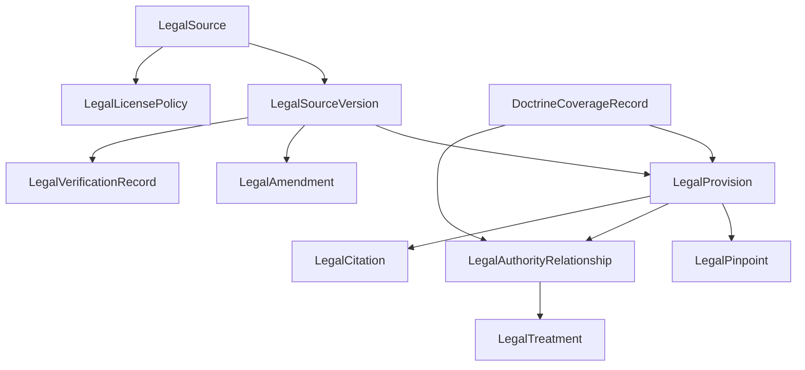

# Minimum Verified Corpus Standard & Canonical Corpus Contract

**Package:** P1-S0 · **Status:** Founder decision draft — specification only (no code, no SQL, no migration, no ingestion, no commits, no push).
**Parent:** [`../DINO_MASTER_SPECIFICATION.md`](../DINO_MASTER_SPECIFICATION.md) ([Vol 5](../DINO_MASTER_SPECIFICATION.md#volume-5--verified-source-and-citation-standard), [Vol 21](../DINO_MASTER_SPECIFICATION.md#volume-21--legal-knowledge-acquisition-roadmap), [Vol 24](../DINO_MASTER_SPECIFICATION.md#volume-24--implementation-governance)).

---

## Part 6 — Canonical corpus contract (conceptual)

Conceptual only — **no TypeScript, no SQL.** These are the singly-owned contracts for the verified corpus, governed by [Vol 24](../DINO_MASTER_SPECIFICATION.md#volume-24--implementation-governance). **Iron rule: no field is inferred when the provider does not supply sufficient evidence — `unknown` stays `unknown`** ([F-5](../DINO_MASTER_SPECIFICATION.md#founder-vision--frozen), [Vol 5 §5.1](../DINO_MASTER_SPECIFICATION.md#volume-5--verified-source-and-citation-standard)).

### 6.1 Entity overview

### 6.2 Entities and required fields

**LegalSource** — a source of law (a statute, a regulation set, a judgment).
`sourceId` (stable) · `sourceType` {statute · regulation · rate_instrument · judgment · administrative} · `provider` · `providerSourceId` · `officialStatus` {official · secondary · unofficial} · `jurisdiction` (IL + forum) · `authorityStrength` {binding · persuasive · interpretive · non_authoritative} · `bindingStatus` · `courtHierarchy` (case law) · `provenance` · `licensePolicyRef` · `corpusVersion`.

**LegalSourceVersion** — a specific in-force/point-in-time version.
`versionId` · `sourceId` · `versionLabel` · `effectiveDate` · `commencementDate` · `publicationDate` · `supersededByVersionId?` · `sourceTextHash` · `permalink` · `directLink` · `ingestionTimestamp` · `lastVerifiedTimestamp` · `verificationStatus` {verified · discovery_only}.

**LegalProvision** — a citable unit (section/subsection/regulation/paragraph).
`provisionId` · `versionId` · `path` (e.g. §/subsection/clause) · `heading` · `text` · `textHash` · `inForce` {true · false · future_effective} · `pinpointRef`.

**LegalAmendment** — one change to a source.
`amendmentId` · `sourceId` · `amendingInstrument` (Reshumot ref) · `amendmentDate` · `effectiveDate` · `affectedProvisions` · `natureOfChange` {added · modified · repealed} · `verificationStatus`.

**LegalCitation** — a renderable citation to a provision/judgment in LawME's citation standard.
`citationId` · `targetRef` (provision/judgment) · `displayFormHe` · `copyableForm` · `authorityLabel` {מחייב · מנחה} · `verificationLabel` {מאומת · טעון אימות} · `officialBadge` · `link` · `pinpointRef` · `licenseDisplayConstraints`.

**LegalPinpoint** — a precise anchor.
`pinpointId` · `provisionOrParagraph` · `anchorType` {section · subsection · clause · paragraph} · `resolvableAnchor?` · `pinpointStatus` {verified · none} · `pinpointStatementHe` (the honest statement when none, [R-5.4](../DINO_MASTER_SPECIFICATION.md#volume-5--verified-source-and-citation-standard)).

**LegalAuthorityRelationship** — a link between authorities (case→statute, case→case).
`relationshipId` · `fromRef` · `toRef` · `relationType` {applies · interprets · follows · distinguishes · overrules · limits · conflicts_with} · `evidenceRef` · `verificationStatus` · `source` {provider · editorial}.

**LegalTreatment** — the treatment/currency status of an authority.
`treatmentId` · `targetRef` · `status` {good · overruled · superseded · limited · distinguished · criticized · conflicting · unknown} · `asOfDate` · `source` {provider_supplied · editorially_verified} · `evidenceRef` · **never** `deterministically_inferred` for negative treatment ([R-5.2](./VERIFIED_LEGAL_SOURCE_STRATEGY.md)).

**LegalLicensePolicy** — usage constraints for a source/provider.
`policyId` · `provider` · `ingestionAllowed` · `displayAllowed` · `maxExcerptChars` · `redistributionAllowed` · `exportToWorkProductAllowed` · `attributionRequired` · `retentionObligations` · `territory` · `termsRef` · `verifiedInWriting` {true · false}.

**LegalVerificationRecord** — the audit stamp that makes a version "verified".
`verificationId` · `versionId` · `verifier` (editor/pipeline) · `method` · `checkedFields` (title, section, dates, permalink, hash) · `result` {verified · rejected} · `timestamp` · `reVerifyDueDate` · `notes`.

**DoctrineCoverageRecord** — per-doctrine coverage truth for the coverage map.
`doctrineId` · `requiredProvisions` · `presentVerifiedProvisions` · `requiredAuthorities` (case law, for P2) · `presentVerifiedAuthorities` · `coverageLevel` {substantial · partial · insufficient} · `gaps` · `permittedClaim` · `lastReviewed`.

### 6.3 Contract invariants
**INV-1** A provision may support a conclusion only if its `LegalSourceVersion.verificationStatus = verified` and a `LegalVerificationRecord.result = verified` exists within the re-verify window. **INV-2** Negative `LegalTreatment` requires `source ∈ {provider_supplied, editorially_verified}`. **INV-3** Any missing field is `unknown`, never fabricated. **INV-4** Rendering obeys `LegalLicensePolicy` (excerpt length, export). **INV-5** Everything is reproducible from `corpusVersion` + `sourceTextHash` + `versionId` ([Vol 19](../DINO_MASTER_SPECIFICATION.md#volume-19--observability-and-audit)).

---

## Part 7 — Minimum Viable Verified Corpus (three bars)

Coverage is **doctrine- and authority-based, not a raw count.** Counts below are floors, not targets.

### Bar A — Internal Development Corpus
- **Purpose:** exercise ingestion → verification → retrieval → citation end-to-end.
- **Covered doctrines:** 1–2 V1 Core doctrines (recommend **D-NOTICE + D-MINWAGE**).
- **Statutes:** their governing statutes, verified with pinpoints; **the current minimum-wage rate instrument** verified with effective date.
- **Regulations:** the notice-form regulation if applicable.
- **Amendment history:** current-version chain for those statutes.
- **Case law:** none required (labeled discovery-only if present).
- **Currentness/treatment:** effective dates verified; re-verify cadence configured.
- **Pinpoints:** section/subsection anchors for the covered provisions.
- **Benchmark:** the P1-S1 seed benchmark passes at 100% ([benchmark spec](./VERIFIED_CITATION_BENCHMARK_SPEC.md)).
- **Expert review:** spot-check by a labor lawyer.
- **Permitted claims:** *internal only* — none public.
- **Prohibited claims:** any external "coverage" claim.

### Bar B — Design-Partner Beta Corpus
- **Purpose:** controlled use by design-partner lawyers under explicit "developing corpus" framing.
- **Covered doctrines:** all **6 V1 Core** doctrines, conclusion-grade; the **5 V1 Conditional** doctrines, analysis-grade.
- **Statutes:** all ~6 Core statutes + principal regulations, verified with pinpoints and current amendment status.
- **Regulations:** notice-form, severance-computation, and the minimum-wage rate instrument, verified.
- **Amendment history:** current chains verified for all Core statutes.
- **Case law:** discovery-only, clearly labeled; **cannot support conclusions**.
- **Case-law depth per doctrine:** none required at Beta (analysis-grade uses statute).
- **Currentness:** all Core effective dates verified; minimum-wage rate current within cadence.
- **Treatment:** n/a (no verified case law yet).
- **Benchmark:** full P1 verified-citation benchmark at **100%**; zero fabrication; zero whole-doc-as-pinpoint.
- **Expert review:** partner sign-off on the Core doctrine answers.
- **Permitted claims:** "grounded labor-law analysis with verified legislation citations; developing corpus; case law not yet verified."
- **Prohibited claims:** "comprehensive research", "verified case law", "complete coverage".

### Bar C — GA Corpus
- **Purpose:** market Dino as a professional labor-law research product for the covered doctrines.
- **Covered doctrines:** the **6 Core (conclusion-grade)** + the **5 Conditional promoted to conclusion-grade** once their case-law dependence is met.
- **Statutes/regulations:** all Core + Conditional governing statutes and principal regulations verified with pinpoints, amendment history, effective dates.
- **Case law:** **verified** leading National Labour Court / Supreme Court authorities for each Conditional doctrine's decisive test, **with treatment status** (from licensed provider and/or editorial verification).
- **Minimum verified case-law depth per doctrine (GA floor):** for each Conditional doctrine, at least the **controlling authority (or the leading line if unsettled)** verified with pinpoint + treatment; conflicting lines both present where they exist ([DR-8](../DINO_MASTER_SPECIFICATION.md#required-decision-records)). A single verified case is not "coverage" if the doctrine has a known contrary line.
- **Currentness/treatment:** all authorities carry `good`/negative treatment from a permitted source; `unknown`-treatment authorities cannot support conclusions.
- **Pinpoints:** paragraph-level for case law; section-level for statutes.
- **Benchmark:** verified-citation benchmark at **100%**, extended with case-law identity/pinpoint/treatment cases; contrary-authority recall threshold met.
- **Expert review:** independent labor-law partner review sign-off per doctrine.
- **Permitted claims:** "professional labor-law research across [named doctrines], grounded in verified legislation and verified case law with current treatment."
- **Prohibited claims:** any doctrine outside the verified set; "complete coverage"; a Shepard's/KeyCite-equivalent treatment claim beyond actual data ([R-5.3](./VERIFIED_LEGAL_SOURCE_STRATEGY.md)).

### 7.1 Gate summary

| Bar | Legislation | Case law | Public claim allowed |
|---|---|---|---|
| A Internal | 1–2 Core statutes verified | none | none |
| B Beta | all 6 Core + regs verified | discovery-only, labeled | "developing corpus" analysis |
| C GA | Core + Conditional verified | verified w/ treatment for Conditional | "professional research, named doctrines" |

*Specification only — no code, SQL, migration, ingestion, scraping, provider connection, commit or push.*
