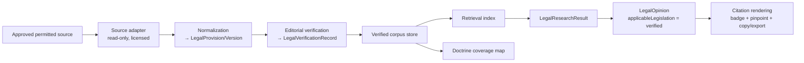

# P1-S1 — Verified Legislation Ingestion — Implementation Plan (NOT YET BUILT)

**Package:** P1-S0 · **Status:** Plan only — **do not implement.** No code, SQL, migration, ingestion, provider connection, commit or push in this document.
**Parent:** [`../DINO_MASTER_SPECIFICATION.md`](../DINO_MASTER_SPECIFICATION.md) · [`../DINO_IMPLEMENTATION_ROADMAP.md`](../DINO_IMPLEMENTATION_ROADMAP.md) (P1-S1) · Depends on the founder decisions in [`FOUNDER_CORPUS_DECISION.md`](./FOUNDER_CORPUS_DECISION.md).

> **Preconditions before a single line is written:** (1) founder ratifies the V1 doctrine set; (2) a **confirmed lawful reuse basis** for the legislation text source (`⚖`) exists in writing; (3) the corpus contract ([MVC](./MINIMUM_VERIFIED_CORPUS_STANDARD.md)) is accepted. Absent (2), P1-S1 does not start — this is a legal gate, not an engineering one.

---

## 1. User-visible value (the whole point)

A lawyer asks a covered labor-law question and receives an answer citing **real, verified legislation** with: exact section/subsection · a verified official/permitted link · verified quoted text · the source version · effective/amendment status · a visible verification badge (מאומת) · a copyable legal citation. This directly closes audit findings 1, 5, 10 and launch blocker **LB-3**.

## 2. Scope (minimal, Bar-A → Bar-B)

- **Doctrines:** start with **D-NOTICE + D-MINWAGE** (Bar A), then extend to all **6 V1 Core** (Bar B) — no Conditional, no case law, no drafting.
- **Sources:** the Core statutes + principal regulations + the **current minimum-wage rate instrument**, from the founder-approved permitted source, editor-verified.
- **Out of scope:** case law (P2), document intelligence (P3), drafting (P4), any Conditional/Deferred doctrine at conclusion-grade.

## 3. Component plan (conceptual — no code)

1. **Source adapter** — a read-only connector to the *approved, permitted* source; respects rate limits/terms; no scraping of disallowed content; fetches only the in-scope instruments. Provider-independent seam ([R-4.5](../DINO_MASTER_SPECIFICATION.md#volume-4--legal-research-system)).
2. **Ingestion process** — bounded to the in-scope statutes/regs; records provenance, license policy, timestamps, text hash.
3. **Normalization** — parse to `LegalProvision`/`LegalSourceVersion` with section/subsection paths; compute `textHash`; capture permalinks.
4. **Verification** — legal editor confirms title, section, dates, permalink, hash against the official source → `LegalVerificationRecord.result = verified`; anything unconfirmed stays `discovery_only`/`unknown` ([INV-1/3](./MINIMUM_VERIFIED_CORPUS_STANDARD.md)).
5. **Versioning & amendment handling** — store version chain + `LegalAmendment`; mark future-effective vs in-force; set `reVerifyDueDate` (short for minimum-wage rate).
6. **Storage & indexing** — a verified-corpus store + retrieval index keyed by doctrine/provision; **migration implications: additive, Development only** (see §7).
7. **Retrieval integration** — the legislation adapter feeds `LegalResearchResult.matchedLegislation` with **verification flags**; discovery-only items never marked verified.
8. **Reasoning integration** — `buildLegalOpinion` consumes only verified provisions as `applicableLegislation` capable of supporting a conclusion; unverified stays discovery-only ([Vol 6](../DINO_MASTER_SPECIFICATION.md#volume-6--legal-reasoning-framework)).
9. **Citation rendering** — source card with authority + verification labels, official badge, resolvable link, pinpoint or the honest no-pinpoint statement, copyable form + Word export within license limits.
10. **Coverage map** — `DoctrineCoverageRecord` per covered doctrine; surfaced in the answer's coverage section (never "complete").
11. **Audit/reproducibility** — stamp `corpusVersion`, `versionId`, `sourceTextHash`, reasoning + provider version, `asOf` timestamp ([Vol 19](../DINO_MASTER_SPECIFICATION.md#volume-19--observability-and-audit)).

## 4. Acceptance criteria

- A covered-doctrine question returns a **verified** legislation citation with exact section/subsection, resolvable official/permitted link, verified quoted text (within license), version + effective/amendment status, visible מאומת badge, and copyable + Word-exportable citation.
- The **verified-citation benchmark** ([spec](./VERIFIED_CITATION_BENCHMARK_SPEC.md)) passes at **100% on every hard gate G1–G9**; ≥ 60 cases; minimum-wage currentness sub-suite green.
- **Negative behavior:** for a covered doctrine with no verified provision, Dino declines to assert law (`no_verified_authority`) and never fabricates.
- **Determinism/immutability** preserved; all existing suites + `capability1:freeze-check` remain green ([R-24.3](../DINO_MASTER_SPECIFICATION.md#volume-24--implementation-governance)).
- **License compliance** verified in rendering; provenance/audit present; answer reproducible from stamped versions.

## 5. Security & licensing controls

Read-only adapter; secrets from env, never logged/committed; no bypass of auth/robots/rate-limits/terms; ingestion strictly within the written license scope; excerpt length + export gated by `LegalLicensePolicy`; RLS/authorization unchanged (legislation is public reference data, not matter data — no new matter-table access) ([Vol 17](../DINO_MASTER_SPECIFICATION.md#volume-17--security-privacy-and-authorization)).

## 6. Test plan

Unit: normalization paths, hash stability, version selection by `asOf`, pinpoint honesty, license-gated rendering. Integration: research→opinion→citation for each Core doctrine; negative/`out_of_scope`; determinism re-run. Benchmark: the full P1 gate. Live Development proof: run a covered question end-to-end in Development and screenshot the verified citation (badge, pinpoint, link, copy/export). No production.

## 7. Migration implications & rollback

- **Migration:** additive verified-corpus storage, **created and applied to Development only**, never Production; **founder approval required before applying any remote migration** (per infra guardrails). Local migration files may be authored without applying.
- **Rollback:** corpus store is additive and versioned; a bad `corpusVersion` is superseded/rolled forward; feature can be gated off (dev flag) leaving the existing deterministic pipeline intact; no destructive drops. Reasoning falls back to prior behavior if the corpus is disabled.

## 8. Provider impact

None — this is legislation ingestion, not an LLM change. The renderer seam is untouched; the deterministic fallback still renders the (now better-cited) opinion.

## 9. Stop gate

Build → validate (benchmark 100% + suites green + live Development proof) → deliver bundle + screenshots → **STOP**. No production, no push, founder review — per the standing slice discipline ([Vol 24](../DINO_MASTER_SPECIFICATION.md#volume-24--implementation-governance)).

*Plan only — nothing here has been implemented. No code, SQL, migration, ingestion, scraping, provider connection, commit or push.*
